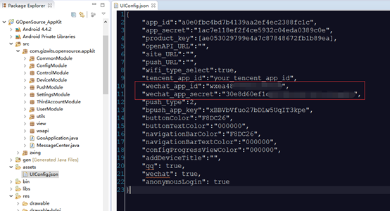
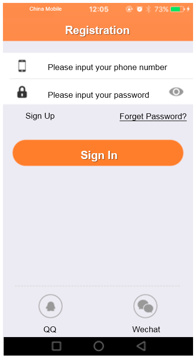
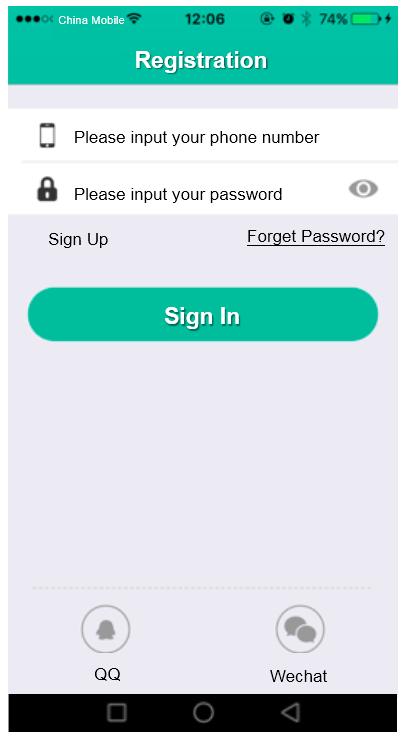

title: Guide of Android App third-party authentication and re-skin
---

See Guide of iOS third party authentication and re-skin

See Application process for third-party authentication platform

# Overview 

This article mainly describes how to quickly implement QQ and WeChat authentication through the open source framework as well as re-skin for the App.

# QQ authentication

To support QQ authentication, you should first create an application on the Tencent open platform, obtain the APPID for the App, which will be used in the open source framework. 

## Get APP ID and bind the application

For obtaining APP ID and binding Gizwits application, see Application Request Tutorial for QQ Open Platform.

## Update UIConfig.json

Type the APPID obtained from Tencent development platform into the configuration file UIConfig.json of the open source framework.


After filling in the "tencent_app_id" and deploying it, you can log in using QQ authentication.

# Wechat authentication

To implement WeChat authentication, you need to go to the WeChat open platform to apply for an application, obtain the APPID and APPSecret of the application which will be applied to the open source framework.

## Get APPID and APPSecret

To get APPID and APPSecret, see Application Request Tutorial for WeChat Open Platform.

## Update UIConfig.json

Type the APPID and APPSecret obtained from WeChat development platform into the open source framework configuration file UIConfig.json, as shown below.



After filling in the "wechat_app_id" and "wechat_app_secret" and deploying it, you can log in using WeChat authentication.

# App Re-Skin

The open source framework has the re-skin feature. Quick re-skin can be achieved by modifying the UIConfig.json file.


 
As shown in the red box, the code snippet for your custom skin has the following parameters:

```
buttonColor: button color
buttonTextColor: button text color
navigationBarColor: navigation bar color
navigationBarTextColor: navigation bar text color
configProgressViewColor: configuration progress view color
```

Quick res-skin can be achieved by modifying the corresponding color values. Refer to the following example:

## Sample 1

```
"buttonColor":"6ebe37",
"buttonTextColor":"ffffff",
"navigationBarColor":"6ebe37",
"navigationBarTextColor":"ffffff",
"configProgressViewColor":"000000",
```

The result:


 
## Sample 2

```
"buttonColor":"ff8a44",
"buttonTextColor":"ffffff",
"navigationBarColor":"ff8a44",
"navigationBarTextColor":"ffffff",
"configProgressViewColor":"000000",
```

The result:


 
## Sample 3

```
"buttonColor":" 16b599",
"buttonTextColor":"ffffff",
"navigationBarColor":" 16b599",
"navigationBarTextColor":"ffffff",
"configProgressViewColor":"000000",
```

The result:



# See Also

See "Introduction to App code auto-generator" to understand what functions the automatically generated App code has;

See "App open source framework" to understand

* Guide of App open source framework for iOS
* Guide of iOS App push notification integration
* Guide of iOS App third-party authentication and re-skin
* Quick start of iOS App development
* Guide of App open source framework for Android
* Guide of Android App push notification integration
* Guide of Android App third-party authentication and re-skin
* Guide of APICloud open source framework

See "App Development SDK" to develop the IoT App (many user cases of design details can be found here)

* Guide of iOS SDK 2.0 integration
* Guide of Android SDK 2.0 integration
* Guide of APICloud SDK
* Explanation of SDK data transparent transmission
* Guide of SDK debug log capture
* SDK error codes

More application development guides

* Application development FAQ
* Device sharing guide
* Application process for third-party authentication platform 
