title: Quick start with Android App development
---

# Overview

This document mainly walks you through how to use the Gizwits App Framework for Android (hereinafter referred as Framework) for rapid App development and testing. Before reading this document, please go through Get started with App development.

# Deploy and debug the Framework in 10 minutes

## 1. Download the Framework

The Framework development environment: Eclipse

The Framework code repository:

https://git.oschina.net/dantang/GizOpenSource_AppKit_Android

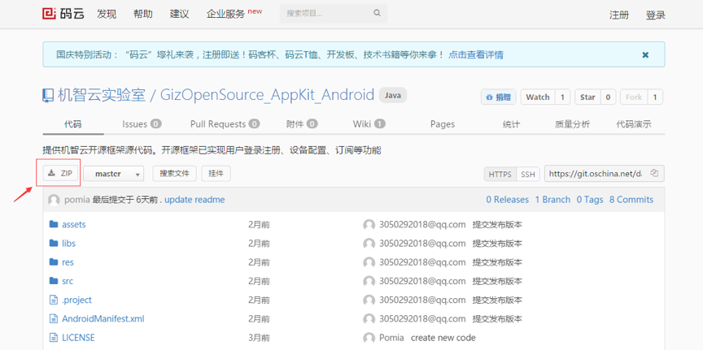
 
## 2. Import project to Eclipse

The following error may occur during the import process.


In this case, you need to change the target version in project.properties to the Android SDK version corresponding to eclipse.

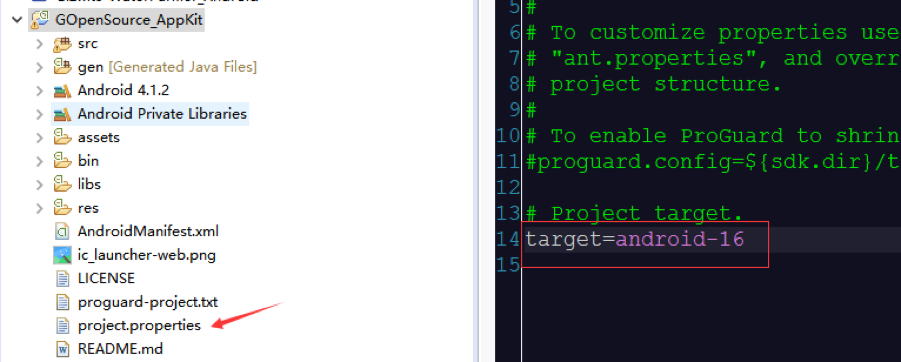
 
## 3. The Framework directory structure

Set the Package Presentation to Hierarchical as shown below.

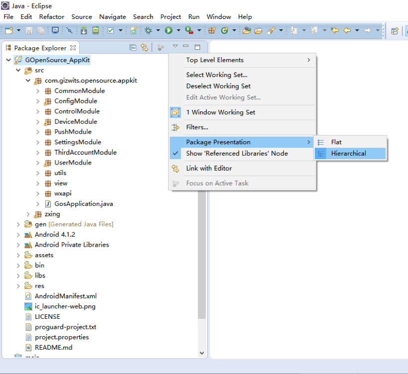

At this point, you can clearly see the directory structure of the entire project. As shown in the figure, the Framework separates each module as a Package to work independently for ensuring maximum decoupling between Packages. During the development, if you want to remove a function, such as third-party authentication, you can directly delete the "ThirdAccountModule" package directly and it will not affect other packages.


## 4. Modify the UIConfig.json

As shown in the above figure, the UIConfig.json file under the assets directory is a global configuration file. Here you can set the configuration information of the project.

* app_id: Gizwits app id
* app_secret: Gizwits app secret
* product_key: Gizwits product key  
* wifi_type_select: Whether the Wi-Fi module selection function is enabled
* tencent_app_id:qq authentication app id 
* wechat_app_id: Wechat authentication app id
* wechat_app_secret: Wechat authentication app secret 
* push_type: Push notification type [0: Off, 1: Jiguang, 2: Baidu]
* bpush_app_key: Baidu push notification app key
* openAPI_URL: Domain name and port, in the format of “api.gizwits.com:80”. Defaults to 80 if unspecified.
* site_URL: Domain name and port, in the format: "site.gizwits.com:80". Defaults to 80 if unspecified.
* push_URL: Push notification service domain name and port, in the format: "push.gizwits.com:80". Defaults to 80 if unspecified.
* buttonColor: Button color
* buttonTextColor: Button text color
* navigationBarColor: Navigation bar color
* navigationBarTextColor: Navigation bar text color
* configProgressViewColor: Configuration progress view color
* addDeviceTitle: Navigation bar text of Adding device page
* qq: QQ login button on the login page [true: display, false: hidden]
* wechat: Wechat login button on the login page [true: display, flase: hide]
* anonymousLogin: Skip button on the login page [true: display, flase: hide]

Find the Product Key, App ID and App Secret on Gizwits IoT Cloud Console, and fill in the corresponding fields in the json file, as shown below:

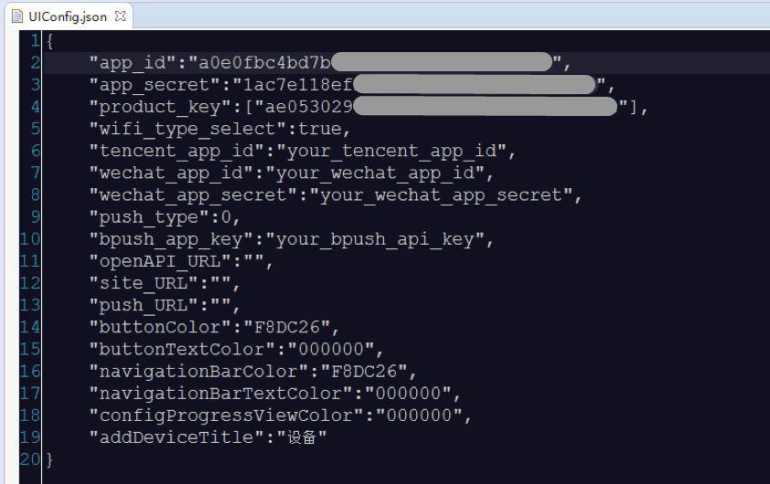

## 5. App deployment

After typing the Product Key, App ID, and App Secret correctly, the project can be deployed and executed.

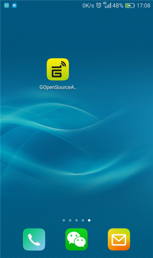


## 6. Register a new user


## 7. Log in the App

After the successful registration, the use will automatically log in and navigate to My Devices page.


 
## 8. Start the virtual device and display its QR code

Choose the "Virtual Device" of the corresponding product in left navigation pane of the Developer Center.

Virtual Device: The Gizwits IoT Cloud automatically generates a simulation device that simulates the behavior of reporting data by real devices. Developers can use the virtual device provided by Gizwits for App development when the development of physical devices has not been completed yet.


## 9. Scan QR code to bind the device

Choose the menu in the upper right corner and click Scan QR code to bind device.


 
After scanning successfully, it will navigate to the "My Devices" page. At this time, the "virtual device" that was just scanned will appear on the page.


 
## 10. Click on "Smart Lamp" to access the device control page


After navigating to the control page, you will find that it is a blank page. In order to develop App quickly, the Gizwits App Framework has encapsulated user login, device discovery, device connection, and other functions into various standard modules, leaving only control pages for you to build on your own demand, which saves your time. The next section will illustrate how to develop a simple and attractive control page quickly.

# Rapid development of device control pages

## 1. Code preview

Open DeviceModule -> GosDeviceController. You can see that the entire control page is very simple, in which only one UILabel displays the device MAC address.

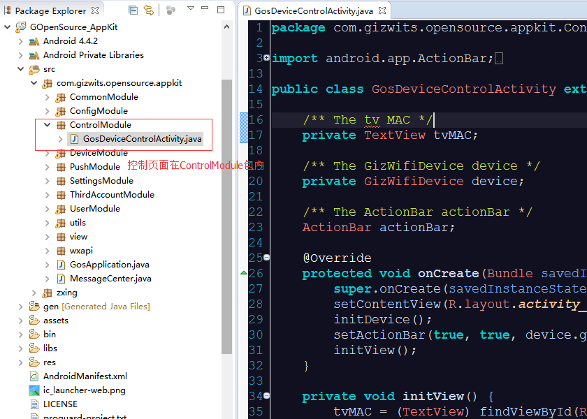

## 2. UI design

According to the created product "Smart Lamp", the expected UI effect is as follows:


Click the lamp icon on the left page, then the App issues an command to control the light switch. The two icons are swapped for each other when tapped.

## 3. Page layout

### 3.1 Import pictures

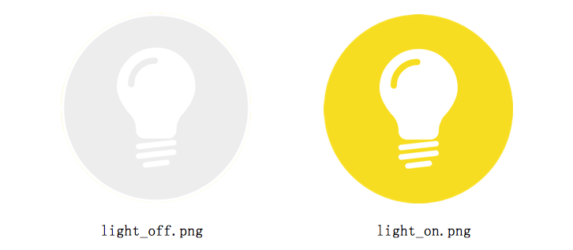

Copy the switch pictures that swap the states of the smart lamp to drawable directory, as shown in the following figure:

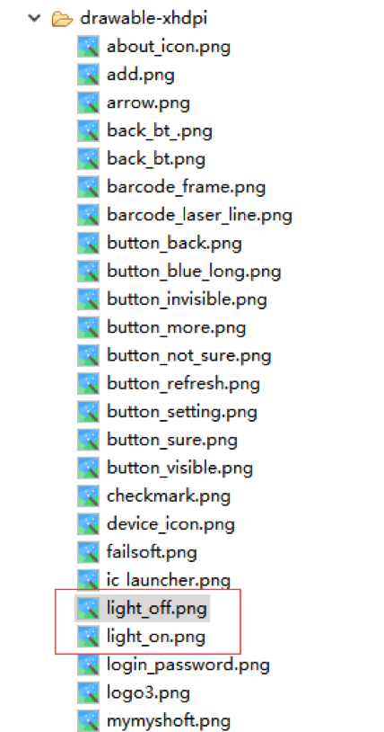
 
### 3.2 Add a Button control

1) Open the layout file "activity_gos_device_control.xml" corresponding to the control page.


2) Add a Button control

As shown in the figure, remove the extra controls from the control page and add a Button control.

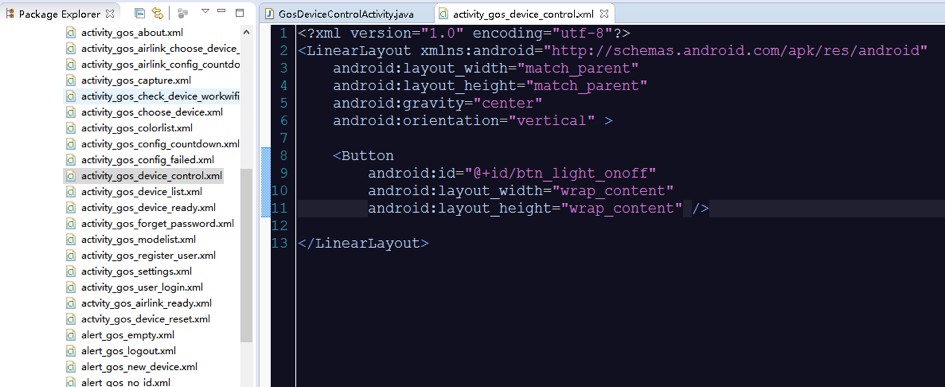

3) Use the selector to control the Button background

Create a new selector file in the drawable folder, as shown in the figure:

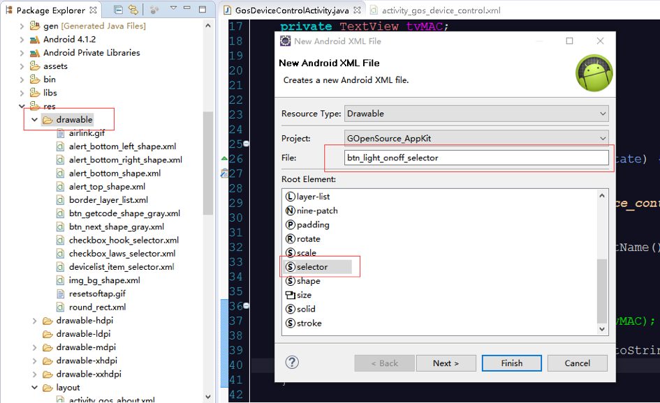

Add the background switch code in btn_light_onoff_selector.xml:

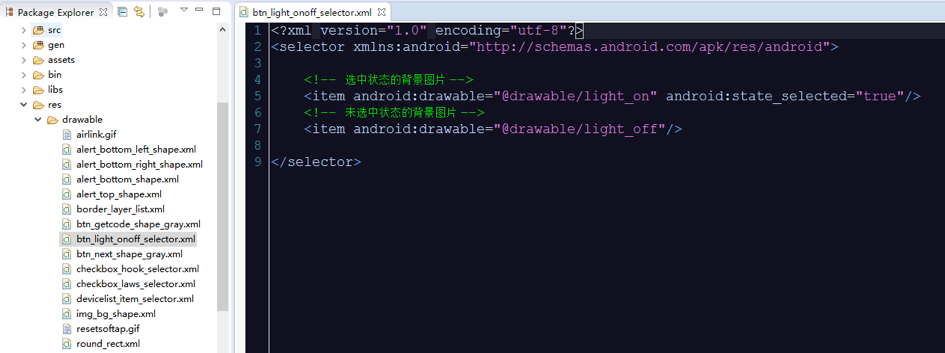

```
<?xml version="1.0" encoding="utf-8"?>
<selector xmlns:android="http://schemas.android.com/apk/res/android">

    <!-- background image for the button's selected state -->
    <item android:drawable="@drawable/light_on" android:state_selected="true"/>
    <!-- background image for the button's unseleted state -->
    <item android:drawable="@drawable/light_off"/>

</selector>
```

4) Set the background of the Button control to btn_light_onoff_selector, the code is as follows:

```
<?xml version="1.0" encoding="utf-8"?>
<LinearLayout xmlns:android="http://schemas.android.com/apk/res/android"
    android:layout_width="match_parent"
    android:layout_height="match_parent"
    android:gravity="center"
    android:orientation="vertical" >

    <Button
        android:id="@+id/btn_light_onoff"
        android:layout_width="wrap_content"
        android:layout_height="wrap_content" 
        android:background="@drawable/btn_light_onoff_selector"/>

</LinearLayout>
```

At this point the entire page layout is ready.

## 4. Implementation of the control page

### 4.1 Create the control page

The figure below shows the Data Point created for the product in the Gizwits IoT Cloud.


The reference code for the entire GosDeviceControlActivity is as follows:

```
package com.gizwits.opensource.appkit.ControlModule;

import java.util.concurrent.ConcurrentHashMap;
import com.gizwits.gizwifisdk.api.GizWifiDevice;
import com.gizwits.gizwifisdk.enumration.GizWifiErrorCode;
import com.gizwits.gizwifisdk.listener.GizWifiDeviceListener;
import com.gizwits.opensource.appkit.CommonModule.GosBaseActivity;
import com.gizwits.opensource.appkit.R;
import android.app.ActionBar;
import android.content.Intent;
import android.os.Bundle;
import android.util.Log;
import android.view.MenuItem;
import android.view.View;
import android.view.View.OnClickListener;
import android.widget.Button;

public class GosDeviceControlActivity extends GosBaseActivity {
	/** Smart lamp */
	private GizWifiDevice device;
	/** Navigation bar */
	ActionBar actionBar;
	/** The Data Point name created in the Gizwits IoT Cloud */
	public static final String LIGHT_SWITCH = "switch";
	/** The smart lamp switch Button */
	private Button btnLightSwitch;
	/** Device listener */
	private GizWifiDeviceListener deviceListener = new GizWifiDeviceListener() {
		// Callback for receiving data
		public void didReceiveData(GizWifiErrorCode result, GizWifiDevice device,
				ConcurrentHashMap<String, Object> dataMap, int sn) {
			// the defined device Data Points with boolean, numeric, or enumration data
			if (dataMap.get("data") != null) {
				ConcurrentHashMap<String, Object> map = (ConcurrentHashMap<String, Object>) dataMap.get("data");				
				// Get the value reported from the device in the map by the name.
				if (map.get(LIGHT_SWITCH) != null) {
					boolean status = (Boolean) map.get(LIGHT_SWITCH);					
					// Change the button icon according to the value reported by the device
					btnLightSwitch.setSelected(status);
				}
			}
		}
	};

	@Override
	protected void onCreate(Bundle savedInstanceState) {
		super.onCreate(savedInstanceState);
		setContentView(R.layout.activity_gos_device_control);
		initDevice();
		// Set ActionBar
		setActionBar(true, true, device.getProductName());
		initView();
	}

	@Override
	protected void onDestroy() {
		super.onDestroy();
		// Exit the control page and take an unsubscribe action on the device
		device.setSubscribe(false);
	}

	/**
	 * Description:Initialize the control
	 */
	private void initView() {
		btnLightSwitch = (Button) findViewById(R.id.btn_light_onoff);
		btnLightSwitch.setOnClickListener(new OnClickListener() {
			@Override
			public void onClick(View v) {
				controlLight();
			}
		});
	}

	/**
	 * Description:Initialize the device
	 */
	private void initDevice() {
		Intent intent = getIntent();
		device = (GizWifiDevice) intent.getParcelableExtra("GizWifiDevice");
		device.setListener(deviceListener);
		Log.i("Apptest", device.getDid());
	}

	@Override
	public boolean onOptionsItemSelected(MenuItem item) {
		switch (item.getItemId()) {
		case android.R.id.home:
			this.finish();
			break;
		}
		return super.onOptionsItemSelected(item);
	}

	/**
	 * Description::Control the smart lamp
	 */
	private void controlLight() {
		if (btnLightSwitch.isSelected()) {
			// issue a command
			sendCommand(false);
			// change the Button state
			btnLightSwitch.setSelected(false);
		} else {
			sendCommand(true);
			btnLightSwitch.setSelected(true);
		}
	}

	/**
	 * Description:the method that issues a command
	 * 
	 * @param onOff
	 *            true for turning on the lamp, false for turning off the lamp
	 */
	private void sendCommand(boolean onOff) {
		int sn = 5;
		ConcurrentHashMap<String, Object> command = new ConcurrentHashMap<String, Object>();
		// The key in the map is the Data Point name created in the Gizwits IoT Cloud, and the value is the data to be transmitted.
		command.put(LIGHT_SWITCH, onOff);
		// call the write method to issue a command
		device.write(command, sn);
	}
}
```

### 4.2 Deployment and debugging

After completing the above code, you can deploy it to your phone for testing.

__The App issues a command__

After the App is deployed on the mobile phone, it goes to the control page as shown below:


Click the light icon in the App, the App will issue a command, and the light icon changes its state from off to on.


At this point, you can see the command sent by the App in the communication log of the cloud virtual device, as shown in the following figure:


__The device reports data__

As shown in the figure of the virtual device, change the value of the switch to “0” and click the Push button below. At this time, you can see that there is a record in the communication log “The virtual device reports data”, indicating that the device successfully reports the data.


At this time, the light icon on the control page of the App immediately changes its state to off, indicating that the App successfully received the reported data from the device.


# See Also

See [Gizwits App Code Auto-Generator](../UserManual/AppCodeAutoGenerator.md) to learn about the functionality of the automatically generated App code.

See "Gizwits App Framework" to grasp

* [Gizwits App Framework for iOS](../AppDev/iOSFramework.md)
* [Push notification integration for iOS App](../AppDev/iOSPushNotification.md)
* [Third-party authentication and re-skin for iOS App](../AppDev/iOSAuthReSkin.md)
* [Quick start with iOS App development](../quickstart/iOSDevQuickStart.md)
* [Gizwits App Framework for Android](../AppDev/AndroidFramework.md)
* [Push notification integration for Android App](../AppDev/AndroidPushNotification.md)
* [Third-party authentication and re-skin for Android](../AppDev/AndroidAuthReSkin.md)
* [Quick start with Android App development](../quickstart/AndroidDevQuickStart.md)
* [Gizwits App Framework for APICloud](../AppDev/APICloudFramework.md)

See "App Development SDK" to develop your IoT App

* [Gizwits App SDK for Android](../AppDev/AndroidSDKA2.md)
* [Gizwits App SDK for iOS](../AppDev/iOSSDKA2.md)
* [Gizwits App SDK for APICloud](../AppDev/APICloudSDK.md)
* [Data transparent transmission](../AppDev/TransparentTransmission.md)
* [Get Gizwits App SDK debug log](../AppDev/SDKLogCapture.md)
* [SDK error codes](../AppDev/SDKErrorCodes.md)

More application development guides

* [FAQ of mobile application development](../AppDev/AppDevFAQ.md)
* [Gizwits Device Sharing](../cloud/DeviceSharing.md)
* [Set up third-party authentication with the provider of choice](../AppDev/ThirdpartyAuth.md)