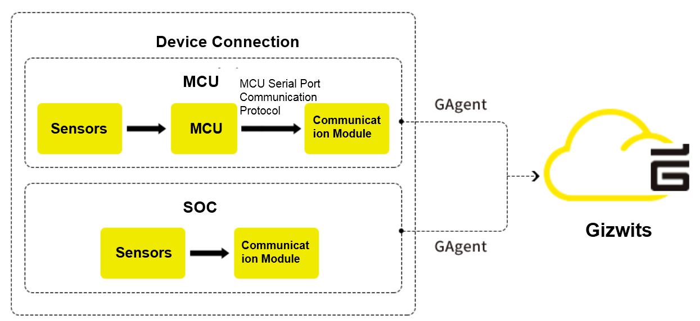
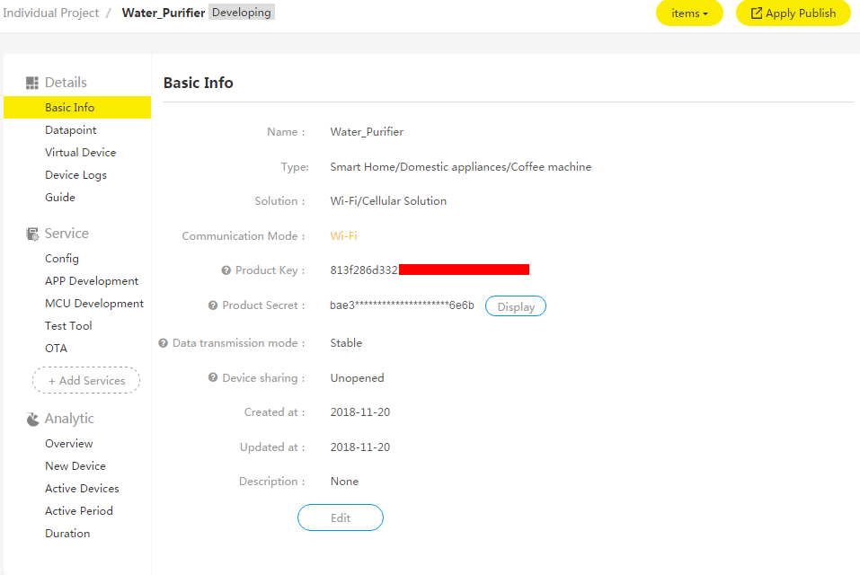

title: Get started with device development
---

# Overview

This document briefly introduces how to get started with device connection using Gizwits MCU Code Auto-generator, communication module firmware downloading with debug log capture, and related information of Gizwits open source development kit - Gokit.

# Documentation brief for Gizwits device connection 

Gizwits provides two types of GAgent communication protocols: MCU and SoC. For the MCU type, it needs to implement the communication protocol encapsulation and parse, sensor data and network data conversion logic following the "Serial communication protocol for Gizwits IoT Cloud access". For the SoC type, the development is carried out on the Wi-Fi module, so there is no obvious concept of MCU.  

## 1. Device connection to Gizwits IoT Cloud

In order to let you quickly know the process of device connection process, we provide two guides to device connection for MCU and SoC schemes respectively based on Gizwits open source development kit - Gokit. Both guides adopt the smart light as a case.

Note: It is not necessary to use Gokit for device connection.

* [Device connection for standalone MCU scheme](../quickstart/MCUScheme.md)
* [Device connection for SoC scheme](../DeviceDev/SoCScheme.md)

## 2.How to use GAgent 

GAgent is Gizwits’s hardware connectivity with the embedded system firmware that can operate in Wi-Fi modules, GPRS modules and PCs etc. Devices access Gizwits IoT Cloud through the GAgent. GAgent provides the communication protocol between cloud and MCU, so that, according to the protocol, developers can realize the communication between MCU and GAgent.

GAgent plays a role of forwarding data, which functions as a data interaction bridge between devices, Gizwits IoT Cloud, and applications(App).

In order to adapt different communication modules to access Gizwits IoT Cloud, we provide multiple firmware downloading and debug log collecting methods for the modules to ensure that the GAgent firmware works normally on the modules. 

Note: When downloading firmware to modules, please go through the steps below, otherwise unknown errors will occur.

* [Gizwits IoT Cloud access with GAgent](../DeviceDev/GAgent.md)
* [Firmware downloading for HF-LPB100 via serial port](../DeviceDev/debug/HF-LPB100.md)
* [Firmware downloading for HF-LPT120 via serial port](../DeviceDev/debug/HF-LPT120.md)
* [Firmware downloading for MXCHIP via serial port](../DeviceDev/debug/MXCHIP.md)
* [Firmware downloading for ESP8266 via serial port](../DeviceDev/debug/ESP8266.md)
* [Firmware downloading for Fibocom G510](../DeviceDev/debug/G510.md)
* [Debug log capture for communication modules](../DeviceDev/DebugLog.md)

## 3.  Introduction to Gizwits App Code Auto-Generator

In order to lower the development barrier, shorten the development cycle, and reduce the development investment, Gizwits has rolled out Gizwits App Code Auto-Generator, which generates the device-side code for the corresponding product based on Data Points defined for the product.

* [Gizwits MCU Code Auto-generator](../DeviceDev/DevSDK/MCUCodeAutoGenerator.md)
* [Porting Common Platform Edition of MCU SDK](../DeviceDev/PortingCommonPlatform.md)

## 4. Gizwits open source development kit - Gokit

In order to facilitate developers to experience Gizwits IoT Cloud faster, Gizwits open source development kit - Gokit is offered for developers to learn and reference, so that developers can connect their products to Gizwits IoT Cloud rapidly.

* [Introduction to Gokit3 series development kit](../DeviceDev/Gokit3/Gokit3Intro.md)
* [Gokit3 hardware manual](../DeviceDev/Gokit3/Gokit3Manual.md)
* [Get started with Gokit3(S)](../DeviceDev/WiFiSOC/Gokit3SGetStarted.md)
* [Introduction to Gokit3(S) development kit](../DeviceDev/WiFiSOC/Gokit3SIntro.md)
* [Set up Gokit3(S) development environment](../DeviceDev/WiFiSOC/SetupGokit3SDevEnv.md)
* [Gokit-SoC program with explanation](../DeviceDev/WiFiSOC/GokitSoCProgram.md)
* [Gokit-MCU program with explanation](../DeviceDev/Gokit3/GokitMCUProgram.md)

## 5. More

* [Gizwits ECE development](../UserManual/ECEDemo.md)
* [Gizwits Serial Port Debugger](../DeviceDev/DebugTool.md)

# Get started

## 1. Create a product

Select the product category and enter the product name, then choose the appropriate network access plan and communication mode according to your product, and set the data transmission mode to fixed length or variable length according to the needs of the project.

After creating the product, you can see the basic properties of your project in the product information - basic information, where the product key is the unique identifier of your product, the product secret is the key used to confirm the user's identity and permissions. The product secrete is required in the auto-generated code.

 
## 2 Define Data Points

For details on creating Data Points, see [Device connection for standalone MCU scheme](../quickstart/MCUScheme.md). 

 
## 3. Download MCU serial communication protocol and SoC connection protocol

Go to the development wizard to download the required communication protocol document according to the project requirements.

Note: If the Data Point changes, the communication protocol document needs to be re-downloaded.

 

