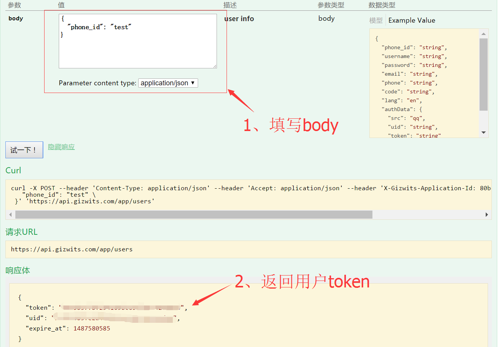
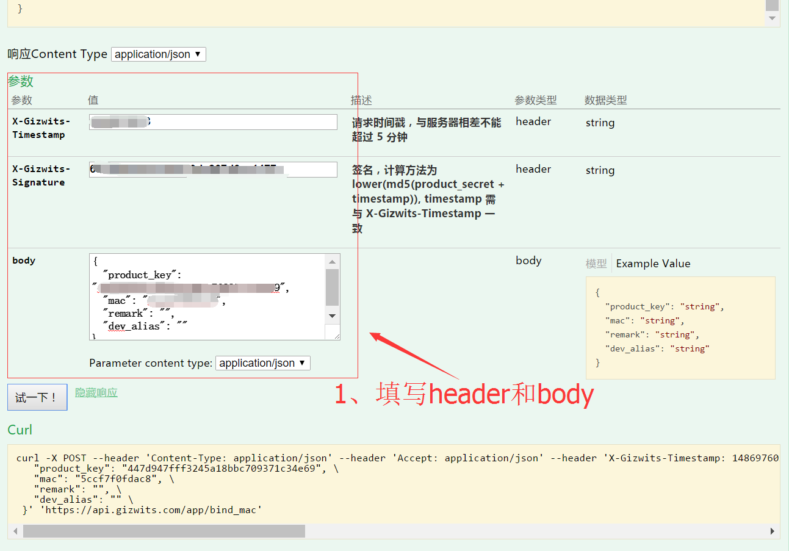
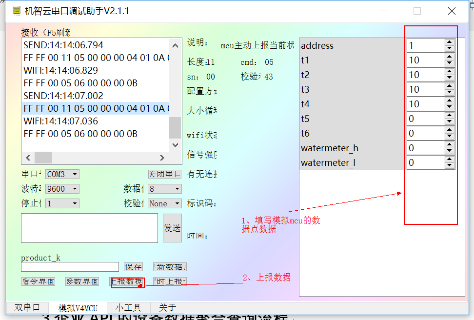
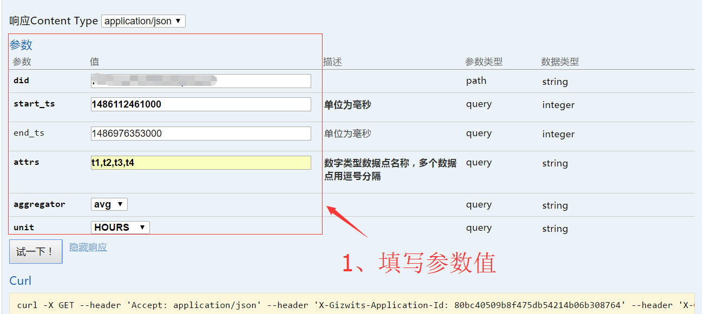
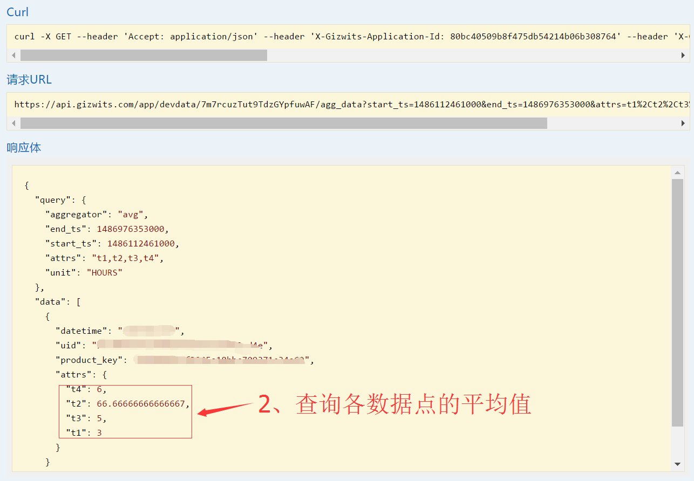
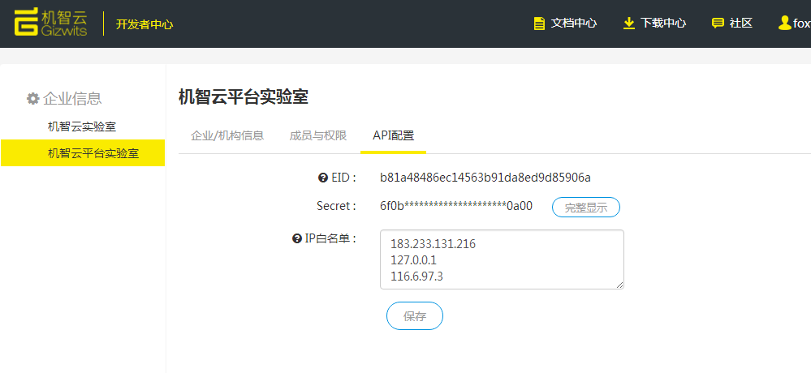
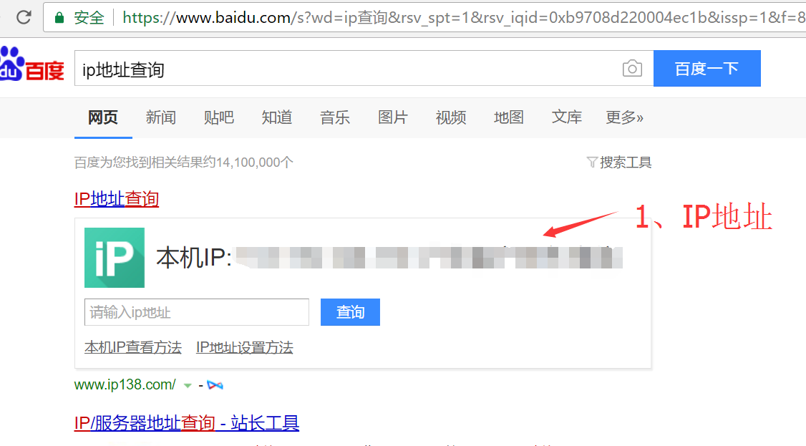
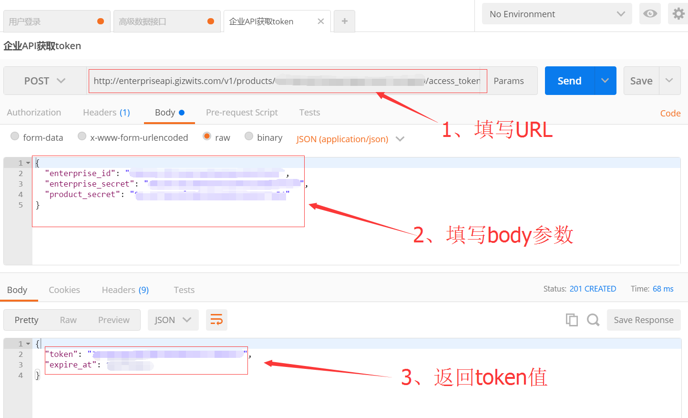
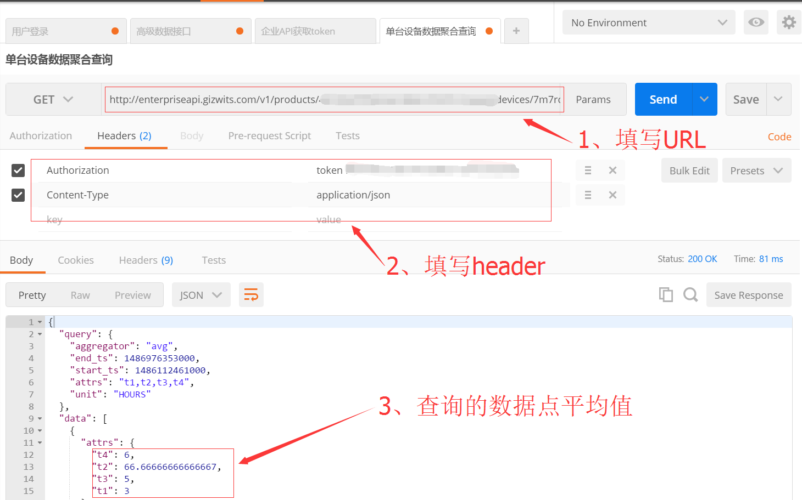

title: Aggregation API Guide
---
# 1. Overview

Aggregation API can aggregate the numeric data point data reported by devices, which supports to calculate the sum/average/maximum/minimum values of data point data for the intervals in hours/days/weeks/months. You can get aggregated data for multiple data points at a time.

To use this API, you must first initiate the access request. Only after the request is approved, the data reported will be aggregated.

For example, for the water consumption data point of a smart water meter, Aggregation API can be used to get the water consumption statistics per household per month, per week, and per day, so that monthly, weekly, and daily reports are available.

# 2. Walkthrough for Advanced Data API of OpenAPI

The Advanced Data API of OpenAPI is used to obtain device aggregation data.

After you have been granted the permission to use the aggregation API of OpenAPI, you can perform aggregation analysis of the numeric data point data reported by devices including calculating the sum/average/maximum/minimum values of data point data for the intervals in hours/days/weeks/months.

## 2.1. Create a User

http://swagger.gizwits.com/doc/index/openapi_apps#/用户管理/post_app_users

The following figure shows how to.



## 2.2. Anonymous user login

The API for anonymous user login is the same as creating an anonymous login user.

## 2.3. Bind device

http://swagger.gizwits.com/doc/index/openapi_apps#/绑定管理/post_app_bind_mac



## 2.4. Report device data

Use the xpg tool provided by Gizwits to simulate a MCU reporting the current device data.

The usage of xpg is as follows:

http://docs.gizwits.com/en-us/deviceDev/串口工具使用文档.html



## 2.5. Data aggregation query

http://swagger.gizwits.com/doc/index/openapi_apps#/高级数据接口



Query result:



# 3. Walkthrough for device data aggregation API of Enterprise API 

The device data aggregation API only performs data aggregation query on a single device, which provides the aggregation operation for a Wi-Fi device numeric data point data in a certain period of time, including sum, average, maximum, and minimum.

Note: Before using Enterprise API, you must first contact Gizwits technical support to apply for the Enterprise API access and set the whitelist on the API configuration page. 

## 3.1. Enterprise API access request

Apply for Enterprise API access:

http://docs.gizwits.com/en-us/Cloud/ent_dev.html

## 3.2. Set IP whitelist



The external IP of your current server is needed.



## 3.3. Apply for aggregation API access

Contact the Gizwits technical personnel and apply for permission to use the device data aggregation API of Enterprise API.

## 3.4. Get a token

Request URL:

http://enterpriseapi.gizwits.com/v1/products/447c947fff3245a18dfc709371c34e69/access_token

Body parameters:

```
{
"enterprise_id": "string",
"enterprise_secret": " string ",
"product_secret": " string "
}
```



Note: It is not possible to request directly on the swagger because the IP of the swagger service is not in your IP whitelist. If you haven't set up a backend server yet, you can use the chrome browser plugin postman to make the request.

## 3.5. Report the device state


## 3.6. Invoke data aggregation API for a single device

Request URL:

http://enterpriseapi.gizwits.com/v1/products/cdfb1e7f2d31474ca10396de88491372/devices/Zb248887fhMVZ2V2Jhz2xfq/agg_data?start_ts=1485151200000&end_ts=1485153000000&attrs=t1%2Ct2%2Ct3%2Ct4&aggregator=avg&unit=HOURS

The parameter values of the URL are:

* product_key
* did
* start_ts
* end_ts
* attrs
* aggregator
* unit

Header parameters:

* Authorize token "enter token here"
* Content-Type application/json



# 4. Other support

Device data aggregation API is for enterprise developers. If you want to apply, please contact us through the official website.

Website address: http://www.gizwits.com/about-us

Gizwits official QR code:


