title: Gizwits ECE development tutorial 
---

This tutorial is used in conjunction with the ECE firmware development kit in the Download Center. This tutorial comes with a demo to teach you how to develop ECE.

# Getting started with ECE

* Gizwits account registration
* Hardware preparation
* Introduction to MCU protocol
* Script compilation and push

## 1. Gizwits account registration

At present, the function of ECE is only provided for an enterprise developer account. It applies to the products created under the enterprise account. 

Quick start with Gizwits IoT Cloud

Step 1: Click on the registration link https://accounts.gizwits.com/en-us/register/


Step 2: Fill out the registration information pane.

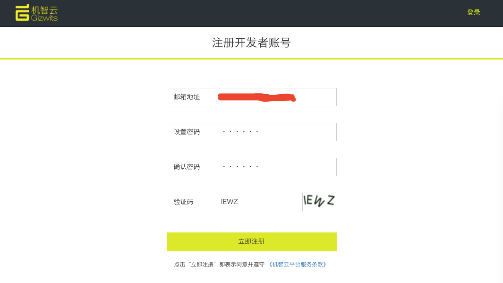

Click Register Now and Gizwits will send an activation email to your registered email address.

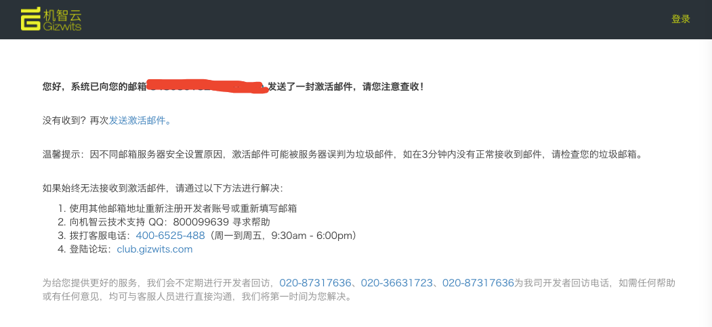

Step 3: Log in to your mailbox and check the Gizwits account activation email.

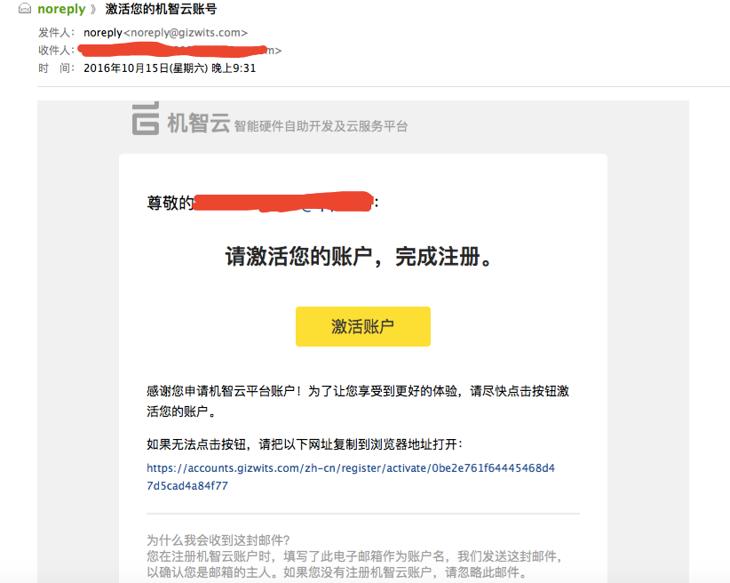

Click Activate to jump to the developer type selection page. Enterprise developers should select the Enterprise Developer type to facilitate the later product development and support. Here we choose the Enterprise Developer. 

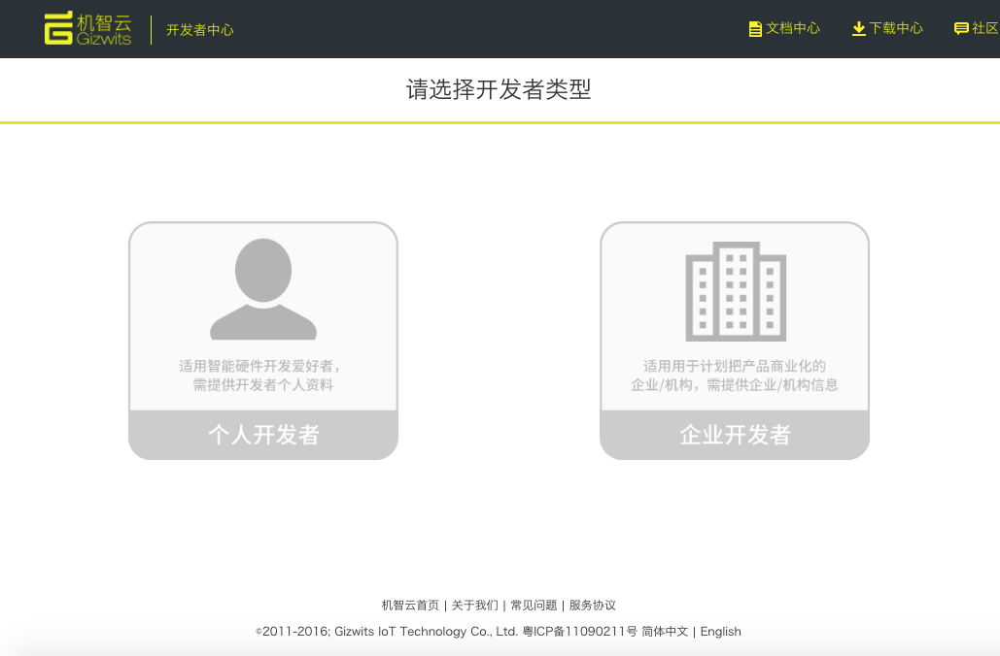

Then complete the enterprise information.

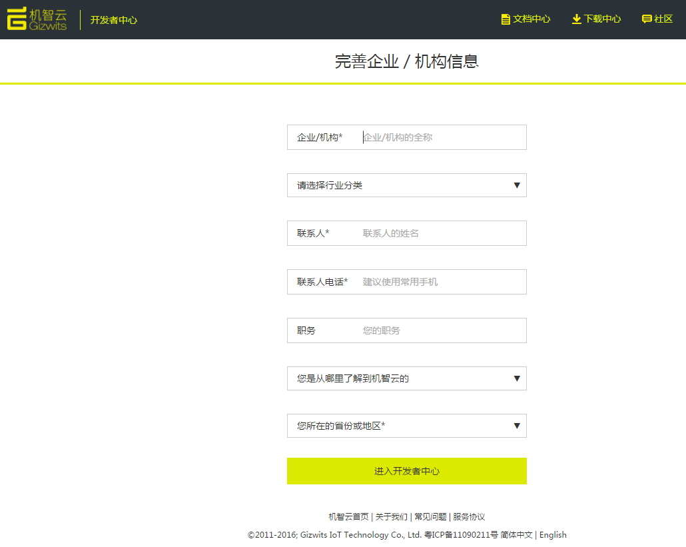

Note: You need to create products under the enterprise projects (not personal projects) to experience the ECE.


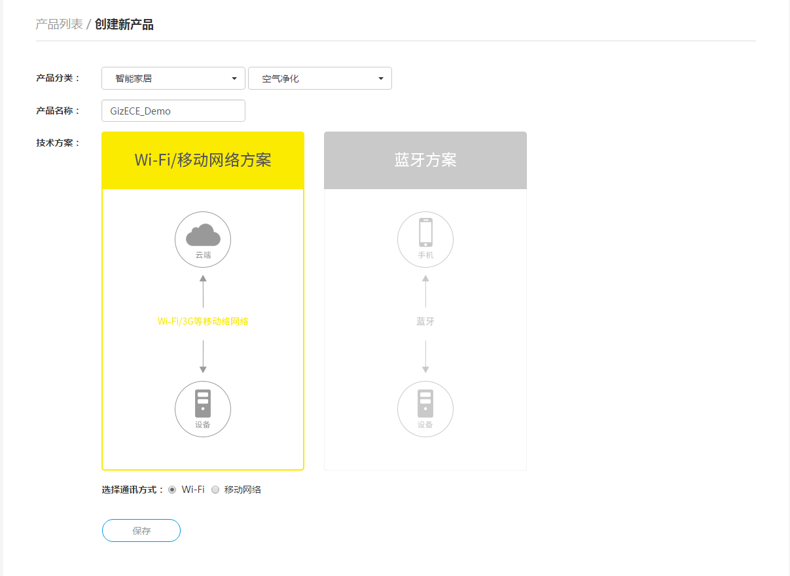 
 

Add ECE service:

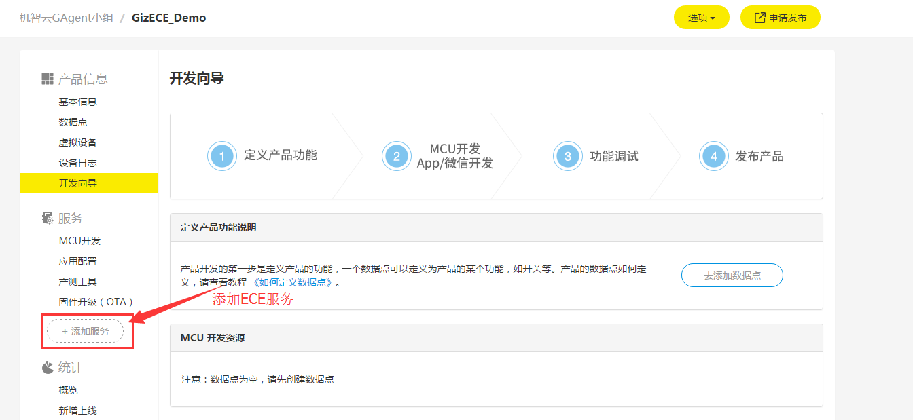

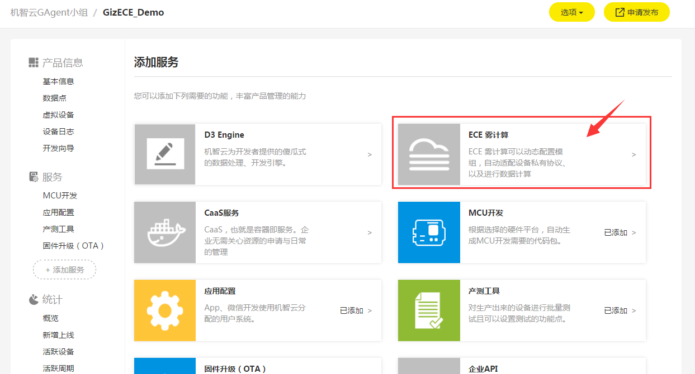

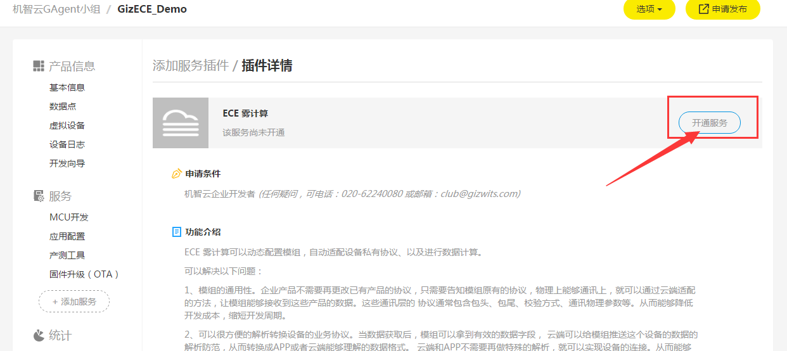

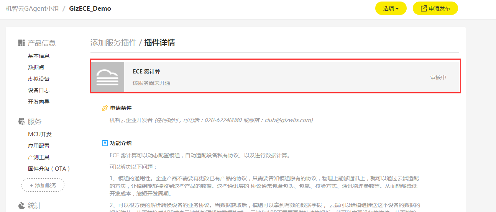 
 

Wait for Gizwits to verify the request to use ECE.

After the verification passes, the following page will appear:

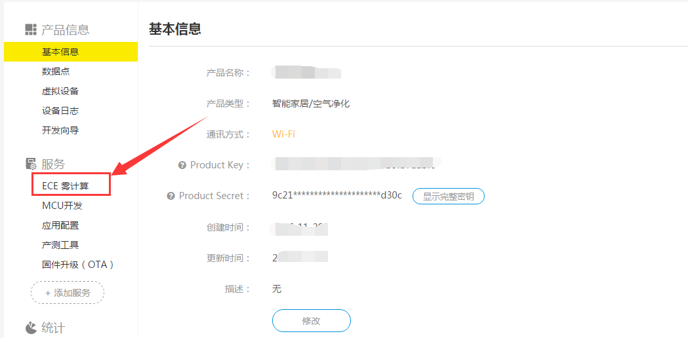


## 2. Hardware preparation

The Gizwits ECE is now based on the GAgent ESP8266 4M Flash hardware platform.

Step 1: You have to find an ESP8266 Wi-Fi module;

Step 2: Get the firmware that supports the ECE provided by Gizwits.

When the above two steps are completed, proceed the firmware downloading.

### 2.1 Connect the module to PC

Connect the ESP8266 module to a USB-to-TTL converter according to the following schematic. Note that GPIO0 (Pin 18) needs to be set to LOW as an input. Here it is connected to ground directly. KEY1 is used for the external reset function.

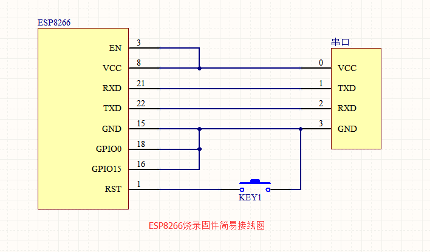

The above figure is a simplified schematic diagram for firmware downloading. When actually setting up the wiring, please refer to the official circuit diagram, as shown below:

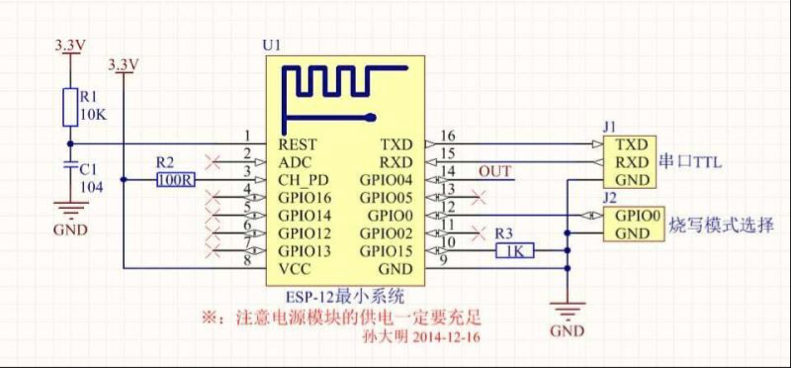

### 2.2 Confirm serial port parameters

After connecting the above USB-to-TTL converter to the PC, you can see the corresponding COM port through the "My Computer" -> "Administration" -> "Device Manager" -> "Port (COM and LPT)".


### 2.3 Get the firmware downloading tool

Download it here: http://pan.baidu.com/s/1mhMGSeG

Unzip the package, you will get the following files.


After unpacking the file shown in the figure again, double-click to launch the ESP FLASH DOWNLOAD TOOL, and the following dialog box will appear.

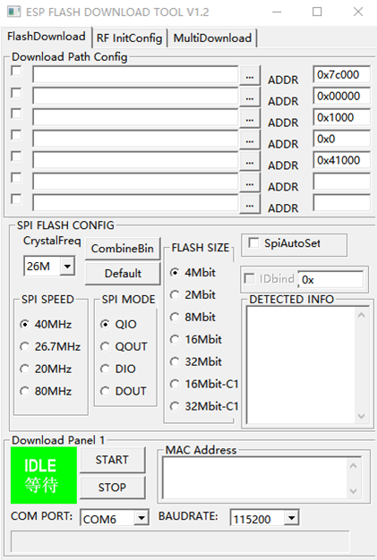

### 2.4 Download firmware via serial port

Get Gizwits ESP8266 Wi-Fi firmware that supports ECE.

Be sure to fill in the fields selected in the following figure in order:

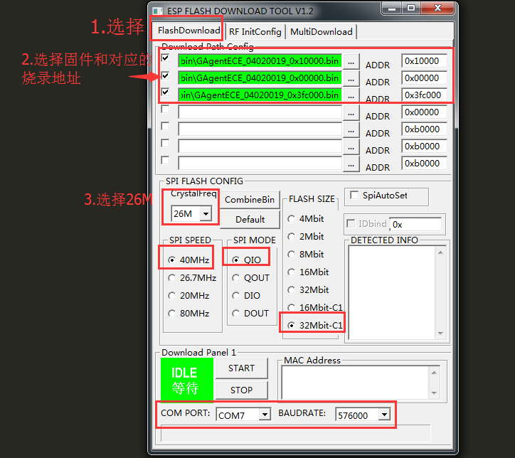

__Flash firmware__

Step 1: Select the actual COM port of ESP8266 and connect it to the PC successfully. Then click START button.


It will display as below.


Step 2: Reset ESP8266 (Press the KEY1 shown in the schematic of section 1 and release it) to enter the download mode. It will start to download the firmware. 

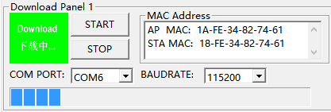

Step 3: After waiting for a while, it will display the FINISH message which indicates that the firmware downloading is successful.

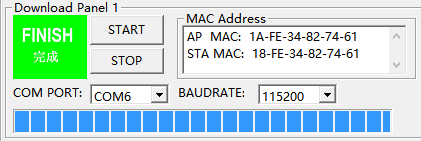

Flash product initialization information:

* Go to the product page and find the corresponding product key, as shown below:

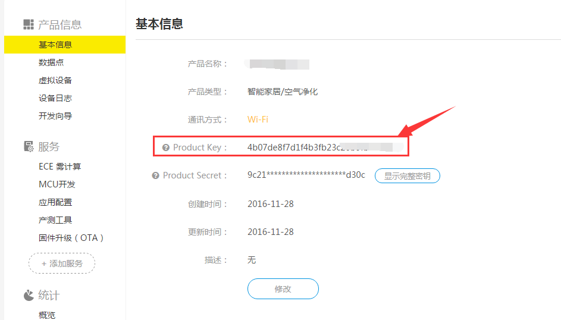

* Save the product key to the init.lua script in the following format:


* Download the file to address 0xb0000. The process is the same as above.

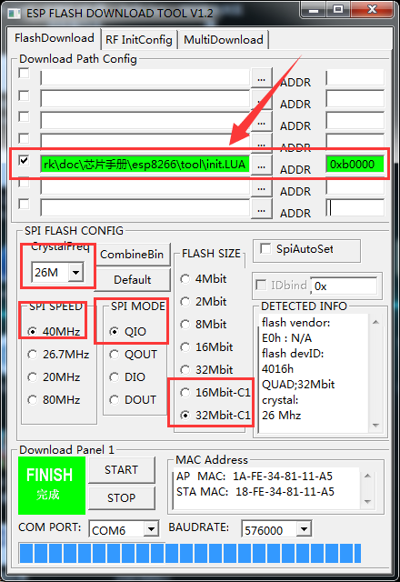

## 3. Introduction to MCU protocol

The MCU communicates with the Wi-Fi module in the form of string. The specific command specification is as follows:

* The MCU tells the Wi-Fi module to enter AirLink configuration mode with cmd=2:

Command:

```
mcu2wifi&cmd=2&mode=0/1
//mode:0 SoftAP configuration mode; mode:1 AirLink configuration mode
```

* The Wi-Fi module responds :

Command:

```
mcu2wifi&cmd=2&result=0/1
```

* The MCU reports device data to the Wi-Fi module with cmd=3:

Command:

```
mcu2wifi&cmd=3&Infrared=1&LedSwitchOnOff=1&MotorSwitchOnOff=1&Temperature=05
```

* The Wi-Fi module sends command to the MCU with cmd=4:

Command:

```
wifi2mcu&cmd=4&LedSwitchOnOff=1或者MotorSwitchOnOff=1
```

The firmware that implements the protocol can be found in Gizwits Download Center: ECE fog computing firmware for ESP8266.

```
gokit_mcu_stm32_ece.hex
```

Firmware downloading tutorial:

http://club.gizwits.com/forum.php?mod=viewthread&tid=3311&highlight=gokit%2B%E7%83%A7%E5%BD%95


## 4. Script compilation and push

### 4.1 Script format and programming rules

Please take the demo.lua script file as a template to write your own Lua application. The demo script needs to be used with the Gokit and the above mentioned module as well as the MCU firmware to accomplish the following functions:

1. When detecting that the temperature is greater than 27 degrees, tells the MCU to turn on the motor;

2. When the infrared tube detects an obstacle, turn on the red light;

Below we define several code blocks by using comment areas:

The application initialization code should be written in the luaInit area, which will only execute once in the entire life cycle of the script. It is used to perform the application's memory allocation and other operations.

```
----------luaInit----------
---------To do------------

----------luaInit end----
```

The application common functions should be written in the luaUtils area.

```
----------luaUtils---------
---------To do------------

----------luaUtils end---
```

The processing of data from App should be written in the luaHandleDataFromApp area.

```
----------luaHandleDataFromApp----------
---------------------To do--------------

----------luaHandleDataFromApp end----
```

The processing of data from device should be written in the luaHandleDataFromDev area.

```
----------luaHandleDataFromDev----------
---------------------To do---------------

----------luaHandleDataFromDev end----
```

Note: Due to the limited ESP8266 resources, the script size of the Lua application cannot be greater than 10K bytes. The number of variables (table\string) defined at once should not exceed 300, and the total number of variables should not exceed 500. 

### 4.2 Lua SDK version and related APIs

SDK version:

```
sdk5.1.4
```

Lua SDK standard library: where string and table are from SDK 5.1.4 standard library.

```
core, math, C API, auxiliary library
```

are not fully supported. There exists tailoring (see the documentation for detailed APIs: gagent_esp8266_api).

APIs encapsulated by GAgent for Lua: gagent_esp8266_api

The tmr timer interface leverages the timer of the ESP8266 platform.

### 4.3 Verify the syntax of the Lua script

To write a good Lua application, you can first use the local IDE to perform syntax compilation and verification to ensure that the syntax compilation is no problem. For the GAgent APIs to be called, you can first use stub code. The recommended Lua IDEs on Windows are SciTE or LuaForWindows.

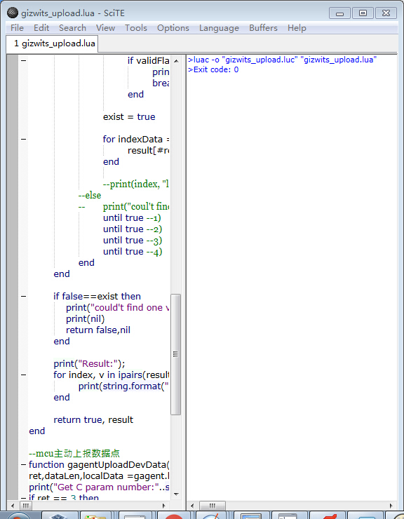

Set Lua development environment on Ubuntu:

```
sudo apt-get install lua、sudo apt-get install lua5.1-0-dev
```

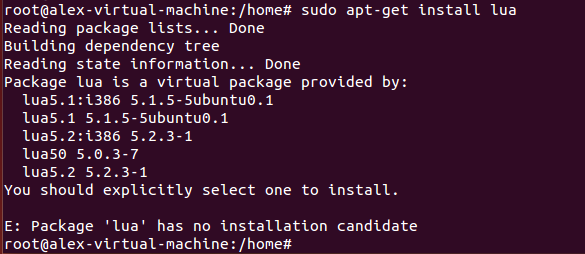

### 4.4 Push script to device

Copy the Lua script to the Lua script push form:

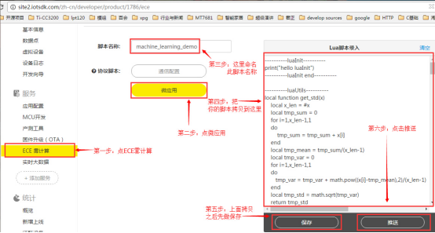

You can specify the MAC address of the target device or devices to push script:

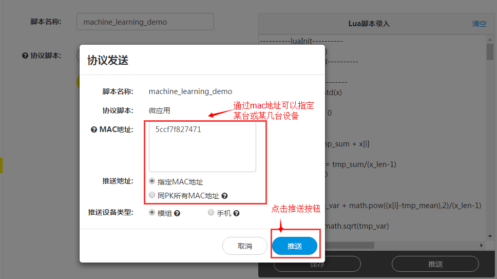

Push feedback:

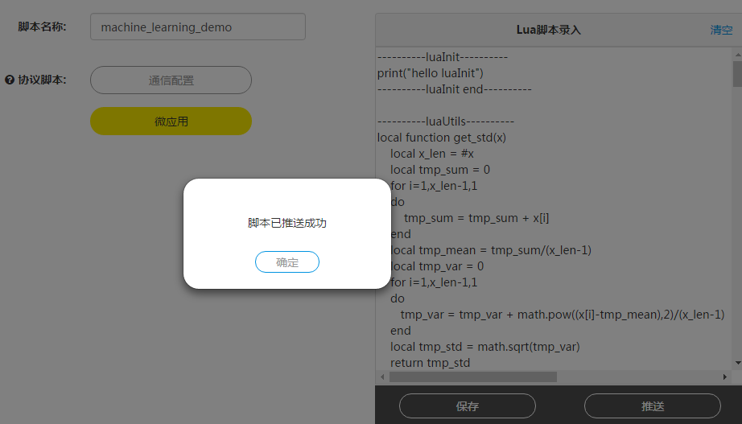

The script push may fail because the target device is offline or the input MAC address is wrong:

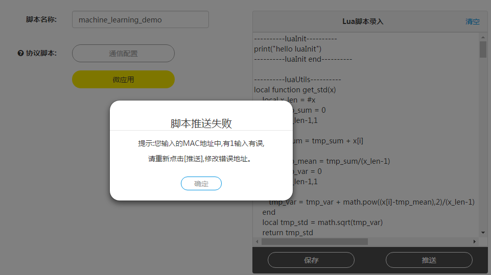

