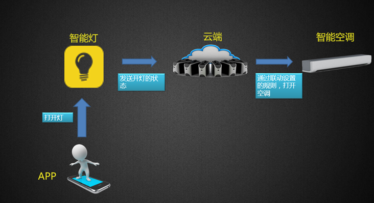
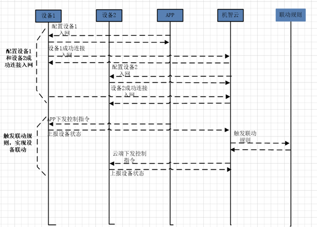

title: Device Linkage API Tutorial
---
# 1. Overview

The Wi-Fi device linkage is implemented by creating a linkage rule between devices. When a device triggers the rule, the cloud issues control instructions to the associated devices. For example, the customer has a smart light and a smart air conditioner, for which a rule can be created based on the device linkage function provided by the Gizwits cloud. When the smart light is turned on, the smart air conditioner will be turned on, whose diagram is as follows.


 
Note: When creating linkage between two products, the two products must be associated with the same appid, otherwise, the error of appid does not exist will occur when requesting.

# 2. Device linkage process

Pre-condition: The source device and target device must be associated to a same user. Then a rule set under the user will enable the linkage between devices.

The following is the flowchart of device linkage:


 
# 3. Device linkage rules

## 3.1. Get available variables

Description: Get all data point names and related variables of the device and product under the same pk associated with appid that can be used when creating rules.

1. Request URL: http://api.gizwits.com/app/rules/params?product_key=pk1,pk2

2. Request method: GET

3. Request Header:

Params|	Data Type|	Required|	Param Type|	Description
-----|-----|-----|-----|-----
product_key	|String|	Yes|	params|	Provide a comma separated list of pk. When leaving blank, all pk associated to the appid are in use by default. When passing a pk that is not associated to the appid, the pk will be invalid.
X-Gizwits-Application-Id|	String|	Yes|	header|	Gizwits APPID
X-Gizwits-User-Token	|String	|Yes	|header	|User token

## 3.2. Create a rule

Description: Create a device linkage rule.

1.Request URL: http://api.gizwits.com/app/rules

2.Request method: POST

3.Request parameters

Params|	Data Type|	Required|	Param Type|	Options|	Description
-----|-----|-----|-----|-----|-----
X-Gizwits-Application-Id|	String|	Yes|	header|		|Gizwits APPID
X-Gizwits-User-Token|	String|	Yes|	header|		|User token
product_key|	String|	Yes	|body|		|Product key
did	|String	|Yes|	body|		|Device did
name|	String|	No|	body|		|Product name
remark|	String	|No|	body|		|Device alias
interval|	Integer|	No|	body|		|The minimum trigger interval in seconds. After a rule with the parameter specified is triggered, it must wait until the specified interval elapses before next triggering.
event|	String|	Yes|	body|	online/offline/alert/fault/data/extern|	Trigger mode. If this parameter is not set or set to empty, its value will be data by default.
event_attr|	Object|	No	|body|		|It’s required when the event parameter is set to alert or fault.
input	|Array|	No	|body|		|Each object in the array represents the data of one device. Omit when you do not need to use device data.
condition|	Array|	No	|body|		|Each sub array in the array represents a set of conditions. If this parameter is not set or set to empty, it means to trigger directly.
output	|Array	|Yes|	body|		|Each sub array in the array represents a set of actions, of which at least one is required.

__Tips__

__a.event__

Indicates the triggering method of the rule. The following is the meaning of the optional value:

* online  - Device comes online
* offline – Device goes offline
* alert   - An alarm occurred on one of the alarm data points of the device
* fault   - An fault occurred on one of the fault data points of the device
* data    - Device reports its state
* extern  - External API call fired

If this parameter is not set or set to empty, its value will be data by default.

__b.event_attr__

When the trigger mode is alert/fault, the data point name for this alarm/fault, and the occurrence/recovery of the alarm/fault, are specified by this parameter:

```
"event_attr": {
    "attr_name": "datapoint_alert", ---- Data point at which this alarm/failure occurred 
    "value": "1"                    ---- The occurrence/cancellation of an alarm/failure. 1 indicates occurrence. 0 indicates cancellation.
}
```

Note: 

The "occurrence" of the alarm/fault mentioned here means that the reported data point value of the last alarm/failure of the device is 0, and its reported value is 1 this time, then the alarm/failure occurs.

The "recovery" of the alarm/failure mentioned here means that the reported data point value of the last alarm/failure of the device is 1, and its reported value is 0 this time, then the alarm/failure recoveries.

Other cases are not "occurrence" and "recovery".

__c.did__

When the trigger mode is online/offline/alert/fault/data, the device that fires this rule is specified by this parameter. The device is designated as the master device in the following.

__d.input__

Specifies the device data to be used in the rule. Each object in the array represents the data of one device. Omit if you do not need to use device data:

```
[{
    "product_key": "pk1", ---- Product key to which the device belongs
    "did": "did1",        ---- Device did
    "prefix": "device1"   ---- the prefix which is used to refer to the data point of the device in condition and output. If this parameter is set to device1, then device1.datapoint1 indicates referring to the data point datapoint1 of the device device1.
}]
```

__e.condition__

Specify the conditions to be satisfied by the trigger rule. The conditions in the array will be checked on a group-by-group basis in the cloud processing. When any set of conditions is met, the rule is triggered.

```
[
    [{
        "left": "device1.datapoint1", ---- Left operand, whose value type needs to be the same as the right operand
        "opt": "==",                  ---- Comparison operator, Available values are: >, >=, <, <=, ==, != (Note: Only numeric values can be compared)
        "right": "1"                  ---- Right operand, whose value type needs to be the same as the left operand. When using a constant, note that "1" represents the number 1, "'1'" or "\"1\" "is the string "1"
	}],
    [{                                ---- Each sub array represents a set of conditions, a set of conditions is satisfied only when all the conditions in this set are satisfied 
        "left": "device1.datapoint1",
        "opt": "==",
        "right": "1"
    },{
        "left": "device2.datapoint2",
        "opt": ">",
        "right": "25"
    }]
]
```

__f.output__

Specify what needs to be done when the conditions are met. The cloud can be thought of as performing all groups of actions in parallel. Each group does not affect each other.

```
	[
	    [{                            ---- Each sub array represents a set of actions, which are executed in sequence. If an action fails, subsequent actions will not be executed.
	        "type": "devctrl",        ---- type of output, devctrl indicates to control the device
	        "did": "did1",            ---- Specify the did of the device to be controlled
	        "attrs": {                 ---- key-value format
	            "datapoint1": 1,      ---- set datapoint1 to 1
	            "datapoint2": 25,
	            "datapoint3": "黄色"
	        }
	    },{
	        "type": "delay",          ---- type of output 
	        "delay": 5                ---- Delay time in seconds
	    },{
	        "type": "devctrl",
	        "did": "did3",
	        "raw": "1111111100000111" ---- raw format
	    }],
	    [{
	        "type": "devctrl",
	        "did": "did2",
	        "attrs": {
	            "datapoint1": 1,
	            "datapoint2": 25,
	            "datapoint3": "黄色"
	        }
	    }]
	]
```

	
__g.Body sample__

```
{
    "product_key": "pk1",
    "did": "did1",
    "name": "name1",
    "remark": "remark1",
    "event": "data",
    "event_attr": {
        "attr_name": "datapoint_alert",
        "value": "1"
    },
    "input": [
        {
            "product_key": "pk1",
            "did": "did1",
            "prefix": "device1"
        },
        {
            "product_key": "pk2",
            "did": "did2",
            "prefix": "device2"
        }
    ],
    "condition": [
        [{
            "left": "device1.datapoint1", ---- Boolean type
            "opt": "==",
            "right": "1"
        }],
        [{
            "left": "device2.datapoint2", ---- Numeric
            "opt": ">",
            "right": "25"
        }],
        [{
            "left": "device2.datapoint3", ---- Enumeration
            "opt": "!=",
            "right": "'黄色'"
        },{
            "left": "device2.datapoint4", ---- Extended type
            "opt": "==",
            "right": "0xFF00"
        }]
    ],
    "output": [
        [{
            "type": "devctrl",
            "did": "did1", 
            "attrs": {
                "datapoint1": 1,
                "datapoint2": 25,
                "datapoint3": "黄色"
            }
        },{
            "type": "delay",
            "delay": 5
        },{
            "type": "devctrl",
            "did": "did3",
            "raw": "1111111100000111"
        }],
        [{
            "type": "devctrl",
            "did": "did2",
            "attrs": {
                "datapoint1": 1,
                "datapoint2": 25,
                "datapoint3": "黄色"
            }
        }]
    ]
}
```

4.Sample rule

When the data point Power_Switch of source device is switched on, the rule will be triggered to turn on the data point OnOff of the target device.

```
{
    "product_key": "9005ab8399bb4338b6131a0522b3a57c",
    "did": "7qSv5w62GK36NkUWFQu8AP",
    "name": "",
    "remark": "",
    "event": "data",
      "input": [
        {
            "product_key":"9005ab8399bb4338b6131a0522b3a57c",
            "did":"7qSv5w62GK36NkUWFQu8AP",
            "prefix":"device1"
        },
        {
            "product_key":"98b133ecaa314d9d8224cd8cbc935c06",
            "did":"qkDCqFiW3s4mbXWAqpFUnW",
            "prefix":"device2"
        }
    ],
    "condition": [
    	 [{
            "left": "device1.Power_Switch", 
            "opt": "==",
            "right": "1"
        }]
	],
    "output": [
        [{
            "type":"devctrl",
            "did":"qkDCqFiW3s4mbXWAqpFUnW", 
            "attrs":{
                "OnOff":1
            }
        }]
    ]
}
```

## 3.3. Get user rules

Description: Get all rules created by a user.

1.Request URL: http://api.gizwits.com/app/rules

2.Request method: GET

3.Request parameters

Params|	Data Type|	Required|	Param Type|	Description
-----|-----|-----|-----|-----
X-Gizwits-Application-Id|	String|	Yes|	Header|	Gizwits APPID
X-Gizwits-User-Token|	String	|Yes	|Header|	User token

## 3.4. Update a rule

Description: Update a rule whose identifier value is rule_id.

1.Request URL: http://api.gizwits.com/app/rules/{rule_id}

2.Request method: PUT

3.Request parameters

Params|	Data Type|	Required|	Param Type|	Options|	Description
-----|-----|-----|-----|-----|-----
X-Gizwits-Application-Id|	String	|Yes|	header|		|Gizwits APPID
X-Gizwits-User-Token|	String|	Yes	|header|		|User token
product_key	|String	|Yes	|body|		|Product key
did	|String	|Yes	|body|		|Device did
name	|String|	No	|body|		|Product name
remark	|String	|No	|body|		|Device alias
interval|	Integer|	No	|body	|	|The minimum trigger interval in seconds. After a rule with the parameter specified is triggered, it must wait until the specified interval elapses before next triggering.
event|	String|	Yes|	body|	online/offline/alert/fault/data/extern	|Trigger mode. If this parameter is not set or set to empty, its value will be data by default.
event_attr|	Object|	No	|body|		|It’s required when the event parameter is set to alert or fault.
input	|Array|	No|	body|		|Each object in the array represents the data of one device. Omit when you do not need to use device data.
condition	|Array|	No|	body|		|Each sub array in the array represents a set of conditions. If this parameter is not set or set to empty, it means to trigger directly.
output|	Array|	Yes|	body|		|Each sub array in the array represents a set of actions, of which at least one is required.

4.Sample rule

```
{
    "product_key": "pk1",
    "did": "did1",
    "name": "name1",
    "remark": "remark1",
    "event": "data",
    "event_attr": {
        "attr_name": "datapoint_alert",
        "value": "1"
    },
    "input": [
        {
            "product_key": "pk1",
            "did": "did1",
            "prefix": "device1"
        },
        {
            "product_key": "pk2",
            "did": "did2",
            "prefix": "device2"
        }
    ],
    "condition": [
        [{
            "left": "device1.datapoint1",
            "opt": "==",
            "right": 1
        }],
        [{
            "left": "device2.datapoint2",
            "opt": ">",
            "right": 25
        }],
        [{
            "left": "device2.datapoint3",
            "opt": "!=",
            "right": "黄色"
        },{
            "left": "device2.datapoint4",
            "opt": "==",
            "right": "0xFF00"
        }]
    ],
    "output": [
        [{
            "type": "devctrl",
            "did": "did1", 
            "attrs": {
                "datapoint1": 1,
                "datapoint2": 25,
                "datapoint3": "黄色"
            }
        },{
            "type": "delay",
            "delay": 5
        },{
            "type": "devctrl",
            "did": "did3",
            "raw": "1111111100000111"
        }],
        [{
            "type": "devctrl",
            "did": "did2",
            "attrs": {
                "datapoint1": 1,
                "datapoint2": 25,
                "datapoint3": "黄色"
            }
        }]
    ]
}
```

5.Sample for updating a rule

When the data point Power_Switch of source device is switched on, the rule will be triggered to turn on the data point OnOff of the target device, and then wait 5s, and then set the data point Lightness of the target device to 25.

```
{
    "product_key": "9005ab8399bb4338b6131a0522b3a57c",
    "did": "7qSv5w62GK36NkUWFQu8AP",
    "name": "",
    "remark": "",
    "event": "data",
    "input": [
        {
            "product_key": "9005ab8399bb4338b6131a0522b3a57c",
            "did": "7qSv5w62GK36NkUWFQu8AP",
            "prefix": "device1"
        },
        {
            "product_key": "98b133ecaa314d9d8224cd8cbc935c06",
            "did": "qkDCqFiW3s4mbXWAqpFUnW",
            "prefix": "device2"
        }
    ],
    "condition": [
        [{
            "left": "device1.Power_Switch",
            "opt": "==",
            "right": "1"
        }]
    ],
    "output": [
        [{
            "type": "devctrl",
            "did": "qkDCqFiW3s4mbXWAqpFUnW", 
            "attrs": {
                "OnOff": 1
            }
        },{
            "type": "delay",
            "delay": 5
        },{
            "type": "devctrl",
            "did": "qkDCqFiW3s4mbXWAqpFUnW",
             "attrs": {
                "Lightness": 25
            }
        }]
    ]
}
```

## 3.5. Delete a rule

Description: Delete a rule whose identifier value is rule_id.

1. Request URL: http://api.gizwits.com/app/rules/{rule_id}

2. Request method: DELETE

3. Request parameters:

Params|	Data Type|	Required|	Param Type|	Options|	Description
-----|-----|-----|-----|-----|-----
X-Gizwits-Application-Id|	String|	Yes	|Header|		|Gizwits APPID
X-Gizwits-User-Token|	String|	Yes|	Header|		|User token
rule_id	|Integer|	Yes|	url	|	|Rule ID

# 4. See Also

* Open API documentation: http://docs.gizwits.com/en/Cloud/openapi_apps.html
* Swagger link: 
http://swagger.gizwits.com/doc/index/openapi_apps#/设备联动

