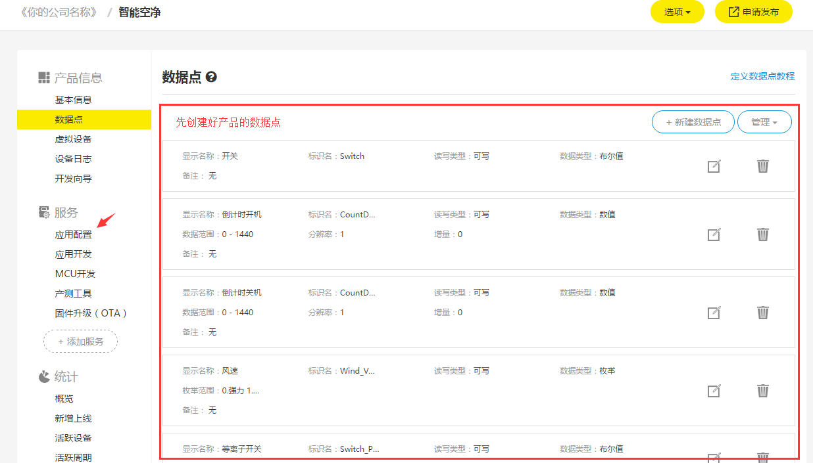
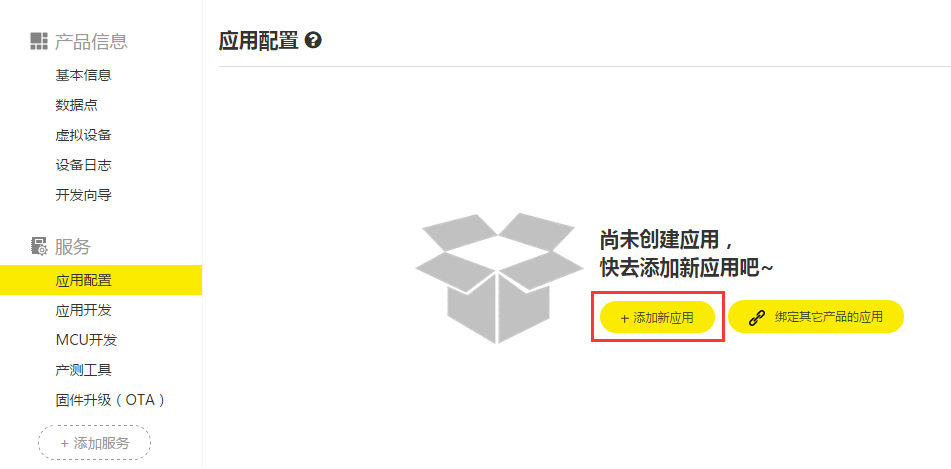
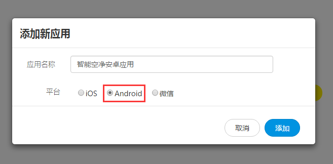
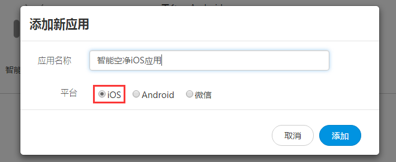
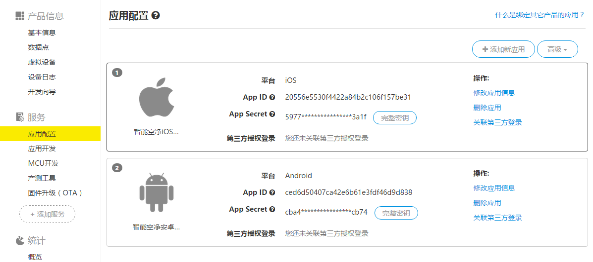
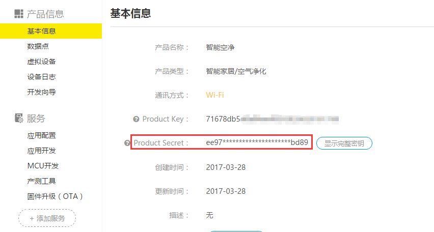
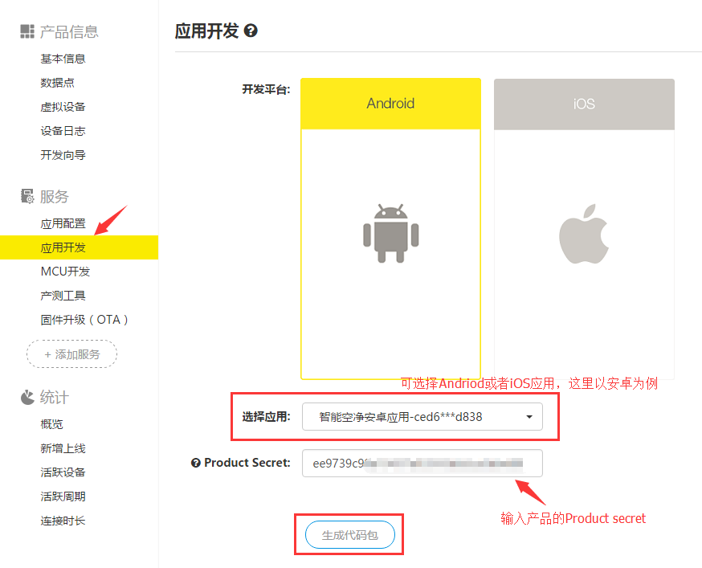
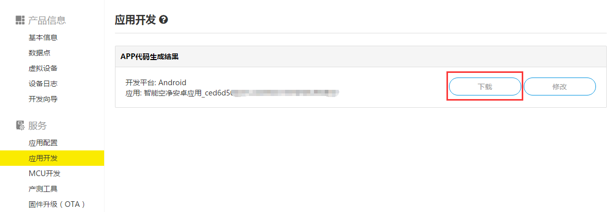

title: App code auto-generator
---

# Overview

In order to lower the barrier for the development of smart hardware App and reduce the investment in development resources, Gizwits has further developed the App open source code that implements the complete functions based on the "App Open Source Framework". After creating corresponding data points on the product project, Gizwits cloud generates an App reference code of the corresponding product according to the defined data points.

The automatically generated App code modularly integrates the necessary functions of a smart hardware App, mainly including:

1. User module: user registration, password recovery, third party anthentication (Wechat, QQ)
2. Network access configuration (Arilink+SoftAP)
3. Device discovery and list
4. Device control
5. Push notification: After the device raises the alarm, the alarm information is pushed to the App. The main push platforms we use are Jiguang Push and Baidu Push.

After developers download the source code, they only need to optimize the UI and design the control logic and device control interface. The control page of the source code implements the standard flow of device control using Gizwits SDK. During the secondary development of the App, you only need to optimize related code according to the process to complete the control App of your own product.

The App code auto-generator currently supports Andriod, iOS, and APICloud.

# User Guide

## 1. Create an application

1.1. After creating the product and data points in the Gizwits Developer Center, choose “Application Configuration”.

Note that the naming of data points cannot be a common programming language keywords, such as switch, static, enum, native, etc. Otherwise, the generated code will be incorrect!

1.2. Choose “New Application” on the Application Configuration page

1.3. Create an Android application and an iOS application separately.

 
 
## 2. Generate code

2.1. Check the product secret and copy it to the clipboard.

2.2. Click “Application Development”, select the Android application you just created, paste the product secret you copied, and click “Generate Code Package”.

2.3. After a while, you can download the source code.

2.4. The downloaded source code is a compressed file. After decompression, you can see the related source code.

2.5. For the guide of the source code, please refer to the appendix "source code explanation" after decompression!

## 3. See Also

See "Introduction to App code auto-generator" to understand what functions the automatically generated App code has;

See "App open source framework" to understand

* Guide of App open source framework for iOS
* Guide of iOS App push notification integration
* Guide of iOS App third-party authentication and re-skin
* Quick start of iOS App development
* Guide of App open source framework for Android
* Guide of Android App push notification integration
* Guide of Android App third-party authentication and re-skin
* Guide of APICloud open source framework

See "App Development SDK" to develop the IoT App (many user cases of design details can be found here)

* Guide of iOS SDK 2.0 integration
* Guide of Android SDK 2.0 integration
* Guide of APICloud SDK
* Explanation of SDK data transparent transmission
* Guide of SDK debug log capture
* SDK error codes

More application development guides

* Application development FAQ
* Device sharing guide
* Application process of third-party authentication platform 
