title: Device Grouping API Tutorial
---

# Overview
The device grouping API can group multiple devices. As long as instructions are sent to a device group, multiple devices under the group can be controlled collectively.

To use device grouping API, you must first create a group. After creating a group, bind a device with its MAC address, and then add the device to the group with the device did that corresponds to its MAC address in the device log. Then send an instruction to the group. The devices in the group receive the instruction and responds, and device grouping is completed.

For example, a company has multiple departments, each of which has multiple smart lights. Every morning anyone of a department comes in, he can just open all smart lights of his department at once. Every evening anyone of a department leaves, all smart lights of his department can be turned off at once.

# Device grouping API usage

The device grouping API is used to group and control multiple devices. When you has set up device grouping API, this API can be called to add multiple devices to a group, so that multiple devices can be controlled collectively.

__1. Open the document center of Gizwits official website -> Cloud API -> OPEN API guide, click any “Debug console” hyperlink.__

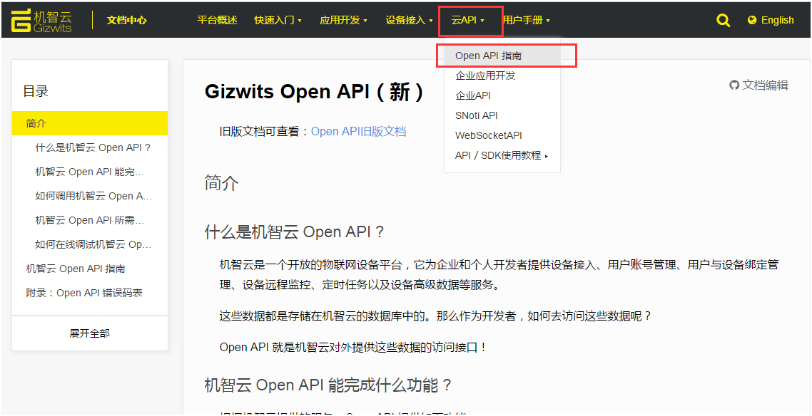

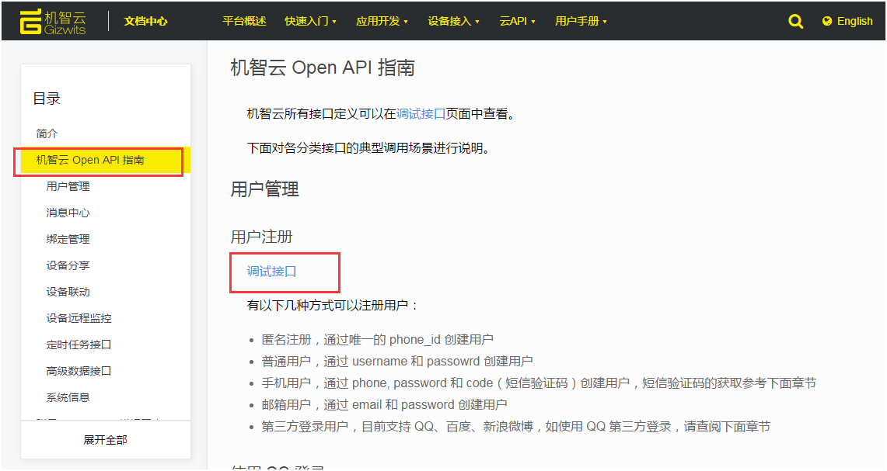
 
__2. Click Device Grouping -> Create a Group__
 
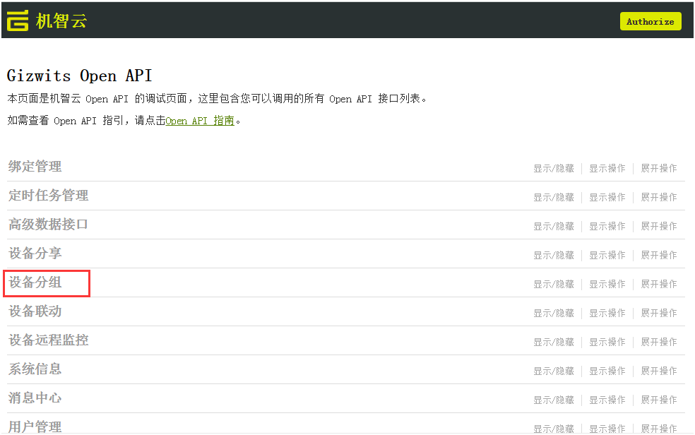

__3. Click Create a Group -> Exclamation Point__

Fill in App ID and token which can be referred to the section "2.3 Create Application Configuration" and "3. Postman Installation and Import" in the document " Using Open API to control virtual device with Postman ". The document link is 

http://docs.gizwits.com/en-us/UserManual/UseOpenAPI.html

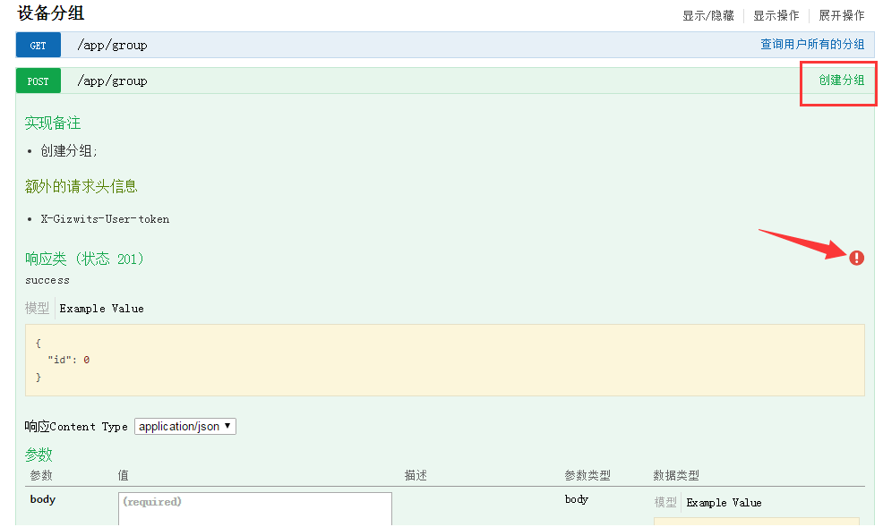

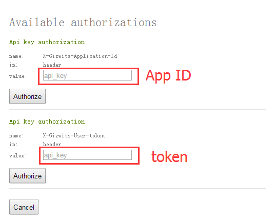
 
 
__4. Fill in the body after completing the App ID and token__

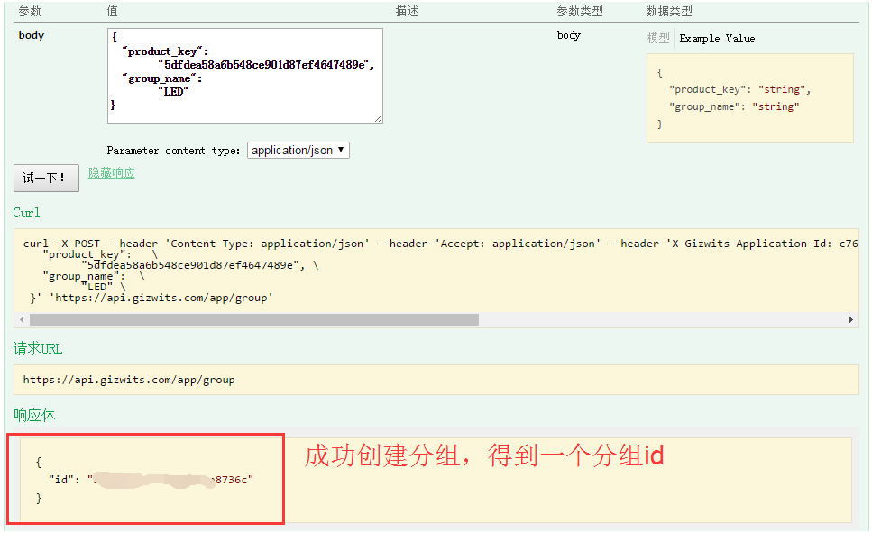
 
 
__5. After getting the group id, check if there is any device in the group__

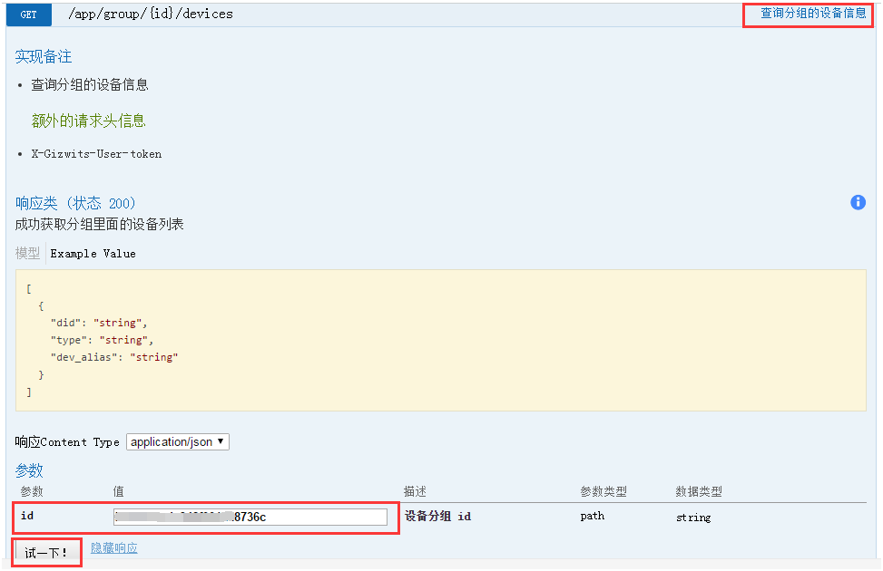

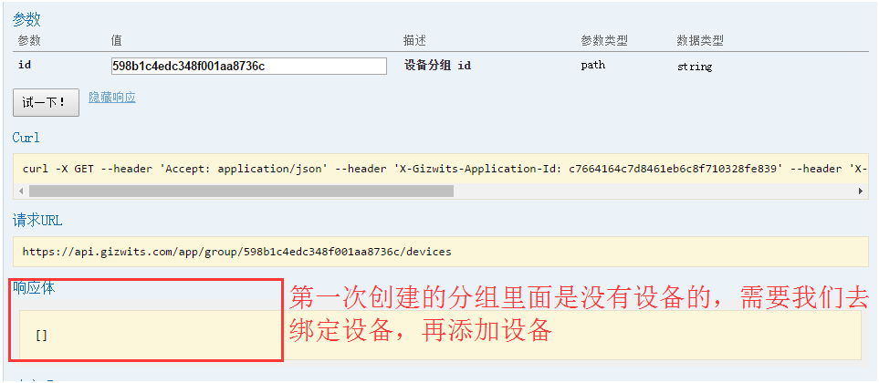
 
__6. Bind a device with its MAC address__

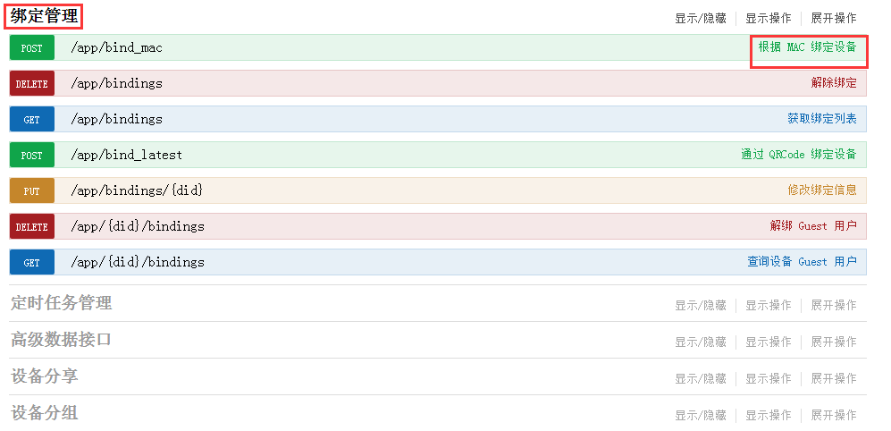

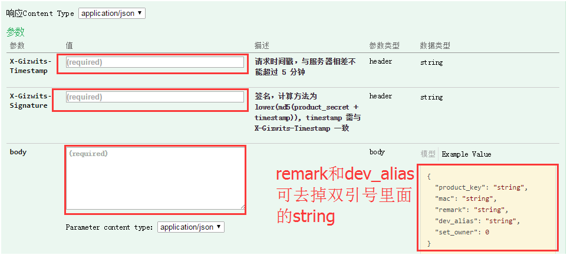
 
Timestamp helper link

http://tool.chinaz.com/Tools/unixtime.aspx

 
Signature helper link

http://tool.chinaz.com/Tools/md5.aspx

 
After the device binding is successful, there will be a response body as follows 

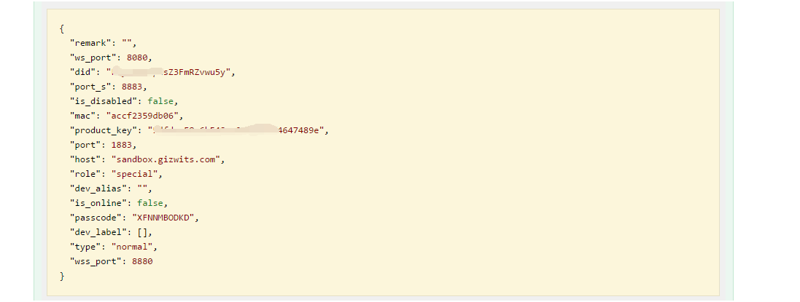
 
__7. After binding the device, we go back to the device group and add the device to the group__

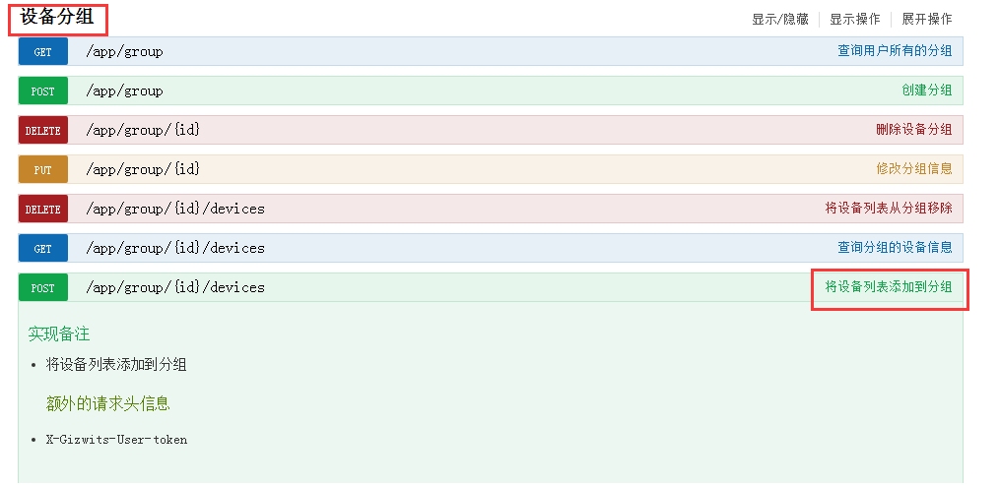

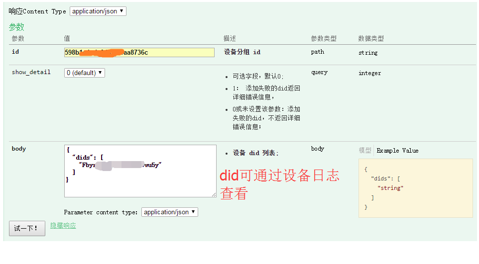
 
__8. Check the device log__

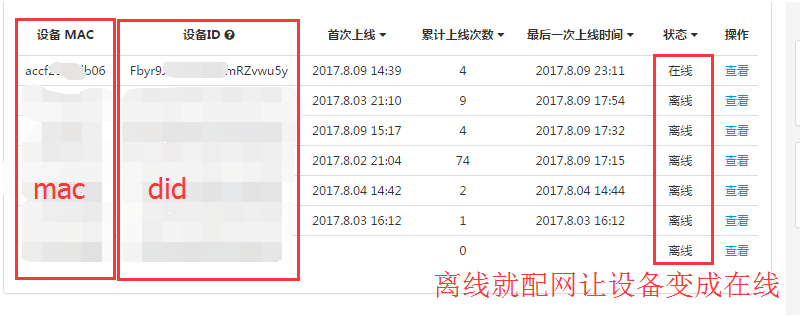
 
__9. After successfully adding the device to the group, you will get the following response body__

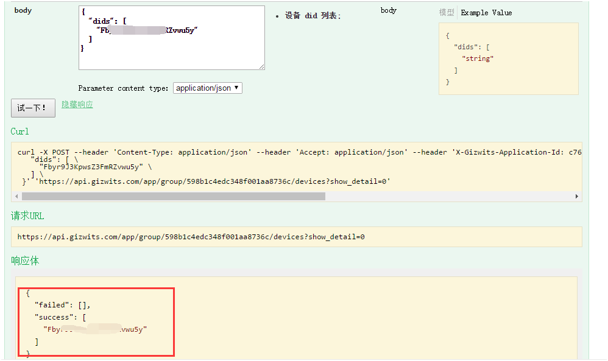
 
__10. Then you send instructions to the device group to control the device remotely__

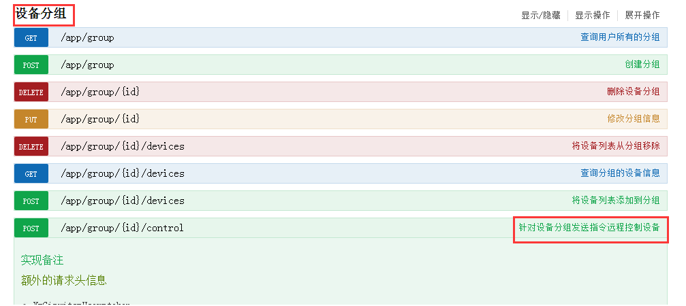
 
__11. In this way we can control a device in a group (RGB light on and off). Add multiple devices to a group in the same way, and we can control multiple devices in a group at the same time.__

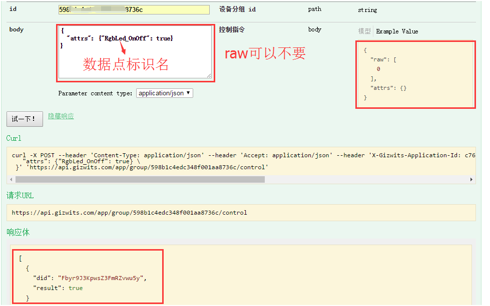
 
