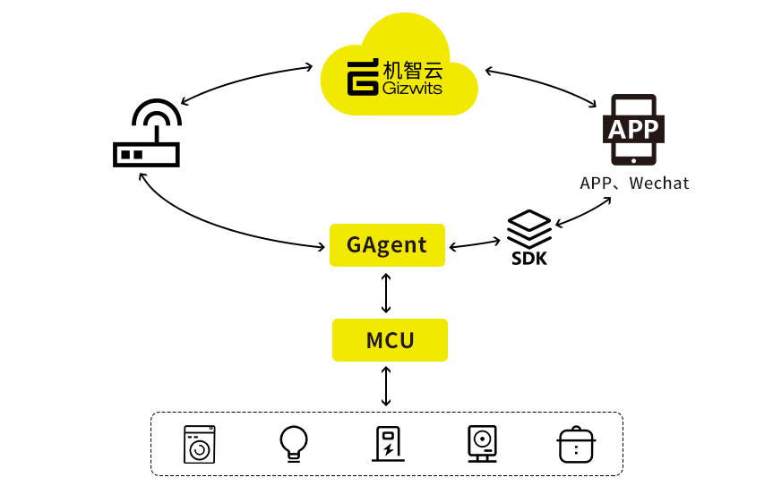
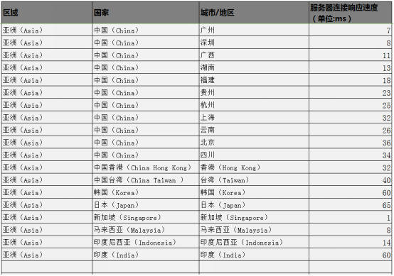
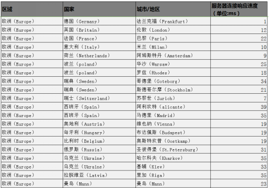
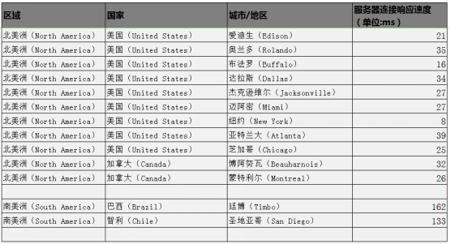

title: Overview
---
# Gizwits IoT Cloud

## 1. Introduction

The Gizwits IoT Cloud is a one-stop intelligent hardware development and cloud services platform that has been built by Gizwits with many years of deeply rooting in the industries as well as actionable insights for individuals and enterprise developers. The platform provides capabilities ranging from products definition, device-side development and debugging, application development, End-of-line test, cloud-side development, operations management, and data services etc., which cover full lifecycle services from intelligent hardware provision to operation management.

The Gizwits IoT Cloud provides developers with self-service smart hardware development tools and open cloud services. With self-service tools for novices, comprehensive SDKs and API service capabilities, the platform lowers the technical barrier for IoT hardware development, reduces R&D costs, accelerates products launch speed, and helps developers promote the intellectualization of products to better connect and serve the end consumers.

## 2. Architecture

## 3. Gizwits Advantages

1. High availability
    - SLA 99.99%
    - EB-level massive data support
    - Flexible and scalable architecture
2. Rapid development for device connection
    - Within only a half day
    - Provide SDKs for each activity in the development process
    - Provide automatic code generation tools
    - Provide ECE capability to automatically adapt private protocols through cloud configuration scripts
    - Provide holistic solutions for industries
3. Professional services
    - Professional tools support for novices
    - Professional support from our solution architecture team
    - Professional operation and maintenance support
4. Deep industry expertise
    - 10000+ enterprise customers
    - 80W + global IoT developers
5. Security
    - Comply with the X.509 certificate standard
    - Encrypted cloud storage for enterprise data  
    - Encryption for key business data 
    - Penetration test by professional security companies
    - Comply with the ISO27000 family of security management standards
6. Multi-tier cloud data services
    - Message Proxy Service: Subscribe to enterprise device data on demand
    - Enterprise API: Provides device control, device management, device location service and device data service etc.
    - D3 Engine: A flexible and powerful data orchestration engine
7. Openness
    - The world's most open IoT self-development platform
    - Integrate with Amazon Echo, WeChat, JD, Nest, Apple HomeKit, Suning Cloud and other major platforms
8. Internationalization
    - Global coverage: Built independent data centers and cloud platforms in China, Europe, America, and Southeast Asia to cover the devices and users in most countries and regions of the world for customers
    - Smart connection: Devices adapt their connections with the nearest cloud servers for acquiring the same service

## 4. Global Network of Gizwits

1.The network response times in Guangzhou, Shenzhen, Guangxi, Hunan, and Fujian cities/regions are all less than 20ms (0.02 seconds); the network response times in other cities/regions of China are generally less than 40ms (0.04 seconds); the network response times in Singapore, Malaysia, Indonesia are less than 20ms (0.02 seconds); other cities in Asia are less than 70ms (0.07 seconds).

2.The response time in the Middle East is less than 70ms (0.07 seconds); the average response time in Oceania is about 98ms; the average response time in Africa is about 150ms (0.15 seconds); the overall situation remains good.

3.The overall network response time in Europe and other regions is less than 40ms (0.04 seconds).

4.The overall network response time in North America and other regions is less than 40 ms (0.04 seconds); the average response time in cities/regions of South America is 146 ms (0.146 seconds); the overall situation remains good.

(PS: Due to network instability, there are small deviations of response time.)

# Quick Start

## Five Minutes to Understand Gizwits

* [Quick start with Gizwits IoT Cloud](../quickstart/GizwitsQuickStart.md)
* [Terms and Definitions](../quickstart/glossary.md)

## Device Connection

# Application Development(App, Wechat)

Gizwits provides the Gizwits App SDKs, Gizwits App Framework, and WeChat SDK to facilitate the quick building of mobile applications. You only need to implement business functions according to the tool guides without considering the underlying functions.

## 1. Get started with App development

[Get started with App development](../quickstart/AppDevGetStarted.md)

## 2. Gizwits App Code Auto-Generator

[Gizwits App Code Auto-Generator](../UserManual/AppCodeAutoGenerator.md)

## 3. Gizwits App Frameworks

* [Gizwits App Framework for iOS](../AppDev/iOSFramework.md)
* [Push notification integration for iOS App](../AppDev/iOSPushNotification.md)
* [Third-party authentication and re-skin for iOS App](../AppDev/iOSAuthReSkin.md)
* [Quick start with iOS App development](../quickstart/iOSDevQuickStart.md)
* [Gizwits App Framework for Android](../AppDev/AndroidFramework.md)
* [Push notification integration for Android App](../AppDev/AndroidPushNotification.md)
* [Third-party authentication and re-skin for Android](../AppDev/AndroidAuthReSkin.md)
* [Quick start with Android App development](../quickstart/AndroidDevQuickStart.md)
* [Gizwits App Framework for APICloud](../AppDev/APICloudFramework.md)

## 4. Gizwits App SDKs

Gizwits App SDKs facilitate developers to rapidly complete App development. You only need to focus on the App UI and UE design, while relatively complex protocols and error handling can be ignored.

* [Gizwits App SDK for Android](../AppDev/AndroidSDKA2.md)
* [Gizwits App SDK for iOS](../AppDev/iOSSDKA2.md)
* [Gizwits App SDK for APICloud](../AppDev/APICloudSDK.md)

## 5. More guides for App development

* [Data transparent transmission](../AppDev/TransparentTransmission.md)
* [How-to videos on Gizwits App Framework](../AppDev/VideoTutorials.md)

## 6. Wechat Application Development

* [Introduction to WeChat application development](../WechatDev/WechatDevIntro.md)
* [WeChat application development](../WechatDev/WeChatDev.md)

# Device Connectivity

## 1. Connect your devices to Gizwits IoT Cloud rapidly

In order to let developers quickly grasp the process of device connection, Gizwits provides two guides to device connection for MCU and SoC schemes respectively based on Gizwits open-source development kit - Gokit. Both guides take the smart light as an example.

Note: It is not necessary to use Gokit for device connection.

* [Device connection for standalone MCU scheme](../quickstart/MCUScheme.md)
* [Device connection for SoC scheme](../DeviceDev/SoCScheme.md)

## 2. GAgent

GAgent is Gizwits’s hardware connectivity with the embedded system firmware that can operate in Wi-Fi modules, GPRS modules and PCs etc. Devices access Gizwits IoT Cloud through the GAgent. GAgent provides the communication protocol between cloud and MCU, so that, according to the protocol, developers can realize the communication between MCU and GAgent.

The main role of GAgent is data forwarding. It is a data exchange bridge among devices, Gizwits IoT Cloud, and applications (App).

In order to enable different communication modules to connect to Gizwits IoT Cloud, we provide multiple firmware downloading methods and debug log collecting methods for those modules to ensure that the GAgent firmware runs normally on the modules.

Note: Please follow the following steps when downloading firmware to modules, otherwise unknown errors will occur.

* [Gizwits IoT Cloud access with GAgent](../DeviceDev/GAgent.md)
* [Firmware downloading for HF-LPB100 via serial port](../DeviceDev/debug/HF-LPB100.md)
* [Firmware downloading for HF-LPT120 via serial port](../DeviceDev/debug/HF-LPT120.md)
* [Firmware downloading for MXCHIP via serial port](../DeviceDev/debug/MXCHIP.md)
* [Firmware downloading for ESP8266 via serial port](../DeviceDev/debug/ESP8266.md)
* [Firmware downloading for Fibocom G510](../DeviceDev/debug/G510.md)
* [Debug log capture for communication modules](../DeviceDev/DebugLog.md)

## 3. Gizwits MCU Code Auto-generator

In order to reduce the barrier for development, shorten the development cycle, and reduce the investment in development resources, Gizwits has rolled out Gizwits MCU Code Auto-Generator, which generates the device-side code for the corresponding product based on the defined product data points.

* [Gizwits MCU Code Auto-generator](../DeviceDev/DevSDK/MCUCodeAutoGenerator.md)
* [Porting Common Platform Edition of MCU SDK](../DeviceDev/PortingCommonPlatform.md)
* [Porting using STM32CubeMX](../DeviceDev/PortingUsingSTM32CubeMX.md)
* [Tailoring MCU SDK to resource-limited platform](../DeviceDev/TailoringMCUCode.md)

## 4. Development kit - Gokit 

In order to enable developers to experience the Gizwits service faster, Gizwits open-source development kit - Gokit is offered for developers to learn and reference, so that developers can connect their own products to Gizwits IoT Cloud quickly.

* [Introduction to Gokit3 series development kit](../DeviceDev/Gokit3/Gokit3Intro.md)
* [Gokit3 hardware manual](../DeviceDev/Gokit3/Gokit3Manual.md)
* [Get started with Gokit3(S)](../DeviceDev/WiFiSOC/Gokit3SGetStarted.md)
* [Introduction to Gokit3(S) development kit](../DeviceDev/WiFiSOC/Gokit3SIntro.md)
* [Set up Gokit3(S) development environment](../DeviceDev/WiFiSOC/SetupGokit3SDevEnv.md)
* [Gokit-SoC program with explanation](../DeviceDev/WiFiSOC/GokitSoCProgram.md)
* [Gokit-MCU program with explanation](../DeviceDev/Gokit3/GokitMCUProgram.md)

## 5. More guides for device connection

* [Gizwits ECE development](../UserManual/ECEDemo.md)
* [Gizwits Serial Port Debugger](../DeviceDev/DebugTool.md)

# Cloud API

If you have completed device connection and App development, and want to obtain data from the Gizwits PaaS platform to build a business management system or access services provided by Gizwits, the following documents should be noticed:

* 1). [Enterprise application development](../cloud/EnterpriseAppDev.md)
* 2). [Gizwits Enterprise API](../cloud/EnterpriseAPI.md)
* 3). [Gizwits SNoti API](../cloud/NotificationAPI.md)
* 4). [Gizwits Open API](../cloud/OpenAPI.md)
* 5). [Gizwits Web Socket API](../cloud/WebsocketAPI.md)
* 6). API tutorials
    - [Control device using Gizwits Open API](../UserManual/UseOpenAPI.md)
    - [Control device using Gizwits Web Socket API](../UserManual/UseWebsocketAPI.md)
	- [Real-time data synchronization using Gizwits SNoti API](../UserManual/UseSNotiAPI.md)
    - [Device Linkage API tutorial](../UserManual/DeviceLinkageAPI.md)
    - [Device Grouping API tutorial](../UserManual/DeviceGroupingAPI.md)
    - [Data Aggregation API tutorial](../UserManual/DataAggregationAPI.md)

# User Manual

* [Promote personal type product to enterprise type product](../UserManual/PromoteProduct.md)
* [GAgent OTA](../UserManual/GAgentOTA.md)
* [End-of-line test](../DeviceDev/EolTest.md)
* [Gizwits D3 Engine](../UserManual/D3.md)
* [Gizwits ECE fog computing](../UserManual/ECE.md)
* [Integration with Amazon Echo](../UserManual/EchoIntegration.md)
* [Gizwits Real-time Big Data Analytics](../UserManual/DataAnalytics.md)
* [Global Network of Gizwits](../UserManual/GlobalDeployment.md)
